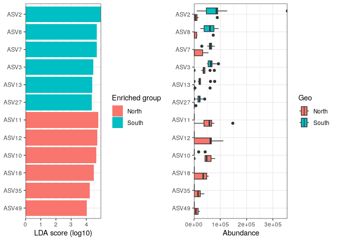

R Notebook
================

``` r
library(phyloseq)
library(ggplot2)
library(dplyr)
```

    ## 
    ## Attaching package: 'dplyr'

    ## The following objects are masked from 'package:stats':
    ## 
    ##     filter, lag

    ## The following objects are masked from 'package:base':
    ## 
    ##     intersect, setdiff, setequal, union

``` r
devtools::load_all(path="course-material-main/R")
```

    ## ℹ Loading ANF_metaB

``` r
output_beta <- here::here("outputs", "beta_diversity")
if (!dir.exists(output_beta)) dir.create(output_beta, recursive = TRUE)
```

``` bash
cp -R course-material-main/data/asv_table ./data/
```

``` r
physeq <- readRDS(here::here("data",
                             "asv_table",
                             "phyloseq_object_alpha_beta_div.rds"))
```

``` r
rowSums(physeq@otu_table@.Data)
```

    ## S11B  S1B  S2B  S2S  S3B  S3S  S4B  S4S  S5B  S5S  S6B  S6S  S7B  S7S  S8B  S8S 
    ##  975  837  893  983  878  889  917 1077 1018 1006 1076  937  878  936  846  958 
    ##  S9B  S9S 
    ##  888  991

``` r
readsumsdf <- data.frame(nreads = sort(taxa_sums(physeq), decreasing = TRUE),
                        sorted = 1:ntaxa(physeq),
                        type = "OTUs")

tmp <- data.frame(nreads = sort(sample_sums(physeq), decreasing = TRUE), 
                  sorted = 1:nsamples(physeq),
                  type = "Samples")

readsumsdf <- rbind(readsumsdf, tmp)

head(readsumsdf)
```

    ##      nreads sorted type
    ## ASV1   1558      1 OTUs
    ## ASV2    973      2 OTUs
    ## ASV3    899      3 OTUs
    ## ASV4    833      4 OTUs
    ## ASV5    767      5 OTUs
    ## ASV6    654      6 OTUs

``` r
ggplot(readsumsdf, aes(x = sorted, y = nreads)) +
  geom_bar(stat = "identity") +
  ggtitle("Total number of reads") +
  scale_y_log10() +
  facet_wrap(~type, nrow = 1, scales = "free")
```

<!-- -->

``` r
# set the seed for random sampling
# it allows reproductibility
set.seed(10000)

# minimum reads in a sample
min(rowSums(physeq@otu_table@.Data))
```

    ## [1] 837

``` r
physeq_rar <- rarefy_even_depth(physeq, sample.size = 800)
```

    ## You set `rngseed` to FALSE. Make sure you've set & recorded
    ##  the random seed of your session for reproducibility.
    ## See `?set.seed`

    ## ...

    ## 5OTUs were removed because they are no longer 
    ## present in any sample after random subsampling

    ## ...

``` r
rowSums(physeq_rar@otu_table@.Data) #how many reads per sample
```

    ## S11B  S1B  S2B  S2S  S3B  S3S  S4B  S4S  S5B  S5S  S6B  S6S  S7B  S7S  S8B  S8S 
    ##  800  800  800  800  800  800  800  800  800  800  800  800  800  800  800  800 
    ##  S9B  S9S 
    ##  800  800

``` r
physeq
```

    ## phyloseq-class experiment-level object
    ## otu_table()   OTU Table:         [ 213 taxa and 18 samples ]
    ## sample_data() Sample Data:       [ 18 samples by 21 sample variables ]
    ## tax_table()   Taxonomy Table:    [ 213 taxa by 7 taxonomic ranks ]
    ## phy_tree()    Phylogenetic Tree: [ 213 tips and 212 internal nodes ]
    ## refseq()      DNAStringSet:      [ 213 reference sequences ]

``` r
physeq_rar
```

    ## phyloseq-class experiment-level object
    ## otu_table()   OTU Table:         [ 208 taxa and 18 samples ]
    ## sample_data() Sample Data:       [ 18 samples by 21 sample variables ]
    ## tax_table()   Taxonomy Table:    [ 208 taxa by 7 taxonomic ranks ]
    ## phy_tree()    Phylogenetic Tree: [ 208 tips and 207 internal nodes ]
    ## refseq()      DNAStringSet:      [ 208 reference sequences ]

``` r
# we first replace the zeros using
 # the Count Zero Multiplicative approach
tmp <- zCompositions::cmultRepl(physeq@otu_table,
                                method = "CZM",
                                label = 0,
                                z.warning = 1)

# generate the centered log-ratio transformed. ASVs are in rows!!!!!
physeq_clr_asv <- apply(tmp, 1, function(x) log(x) - mean(log(x)))
```

``` r
#create a new phyloseq object with CLR tranformed counts
physeq_clr <- physeq
otu_table(physeq_clr) <- otu_table(t(physeq_clr_asv),
                                   taxa_are_rows = FALSE)
data.frame(physeq_clr@otu_table@.Data[1:5, 1:10])
```

    ##          ASV1       ASV2     ASV3       ASV4     ASV5     ASV6       ASV7
    ## S11B 5.172800  3.6295018 4.853277  4.6591212 4.876534 4.099505  4.4536772
    ## S1B  4.630559 -0.6264429 3.561361 -0.6264429 4.357692 4.297068 -0.6264429
    ## S2B  4.065517 -0.7557464 3.859665  3.0123670 4.041986 4.255561 -0.7557464
    ## S2S  5.042825  4.8740037 4.738829  2.8930022 5.003215 4.169296  3.9916145
    ## S3B  4.440233 -0.6954498 3.828432 -0.6954498 4.254516 4.653155 -0.6954498
    ##            ASV8       ASV9      ASV10
    ## S11B  3.9369865  4.1241980 -0.6524920
    ## S1B  -0.6264429  3.7217036  4.4863097
    ## S2B  -0.7557464 -0.7557464  4.0655169
    ## S2S   4.6847617  4.2367369 -0.6558837
    ## S3B  -0.6954498 -0.6954498  4.4057470

``` r
physeq_phylum <- physeq_rar %>%
  tax_glom(taxrank = "Family") %>%                     # agglomerate at the Family level
  transform_sample_counts(function(x) {x/sum(x)} ) %>% # Transform to rel. abundance
  psmelt() %>%                                         # Melt to long format
  filter(Abundance > 0.02) %>%                         # Filter out low abundance taxa
  arrange(Family)                                      # Sort data frame alphabetically by phylum

head(physeq_phylum)
```

    ##    OTU Sample Abundance SampName   Geo Description groupe Pres PicoEuk Synec
    ## 1 ASV7    S4S 0.2483311      S4S North     North4S    NBS   78    2220  3130
    ## 2 ASV7    S4B 0.2129784      S4B North     North4B    NBF   78    2220  3130
    ## 3 ASV7    S5S 0.1833085      S5S North     North5S    NBS    0    1620 56555
    ## 4 ASV7    S2B 0.1776119      S2B North     North2B    NBF   59     890 25480
    ## 5 ASV7    S3S 0.1745283      S3S North     North3S    NBS    0     715 26725
    ## 6 ASV7    S5B 0.1741214      S5B North     North5B    NBF   42    1620 55780
    ##   Prochloro NanoEuk Crypto SiOH4   NO2   NO3   NH4   PO4    NT    PT   Chla
    ## 1     29835    2120    235 2.457 0.099 1.087 0.349 0.137 8.689 3.129 0.0000
    ## 2     29835    2120    235 2.457 0.099 1.087 0.349 0.137 8.689 3.129 0.0000
    ## 3     22835    2560    945 2.669 0.136 0.785 0.267 0.114 9.146 3.062 0.0000
    ## 4     16595     670    395 2.592 0.105 1.125 0.328 0.067 9.378 3.391 0.0000
    ## 5     16860     890    200 1.656 0.098 0.794 0.367 0.095 7.847 2.520 0.0000
    ## 6     23795    2555   1355 2.028 0.103 1.135 0.216 0.128 8.623 3.137 0.0102
    ##         T       S Sigma_t  Kingdom         Phylum               Class
    ## 1 18.8515 37.4542 26.9415 Bacteria Proteobacteria Alphaproteobacteria
    ## 2 18.8515 37.4542 26.9415 Bacteria Proteobacteria Alphaproteobacteria
    ## 3 24.1789 38.3213 26.1065 Bacteria Proteobacteria Alphaproteobacteria
    ## 4 22.6824 37.6627 26.0521 Bacteria Proteobacteria Alphaproteobacteria
    ## 5 22.5610 37.5960 26.0332 Bacteria Proteobacteria Alphaproteobacteria
    ## 6 24.1905 38.3192 26.1037 Bacteria Proteobacteria Alphaproteobacteria
    ##              Order                  Family
    ## 1 Rhodospirillales AEGEAN-169 marine group
    ## 2 Rhodospirillales AEGEAN-169 marine group
    ## 3 Rhodospirillales AEGEAN-169 marine group
    ## 4 Rhodospirillales AEGEAN-169 marine group
    ## 5 Rhodospirillales AEGEAN-169 marine group
    ## 6 Rhodospirillales AEGEAN-169 marine group

``` r
pdf(file="treemap.pdf", wi = 7, he = 7)

treemap::treemap(physeq_phylum, index=c("Class", "Family"), vSize="Abundance", type="index",
        fontsize.labels=c(15,12),                # size of labels. Give the size per level of aggregation: size for group, size for subgroup, sub-subgroups...
        fontcolor.labels=c("white","black"),    # Color of labels
        fontface.labels=c(2,1),                  # Font of labels: 1,2,3,4 for normal, bold, italic, bold-italic...
        align.labels=list(
          c("center", "center"), 
          c("left", "bottom")),                 # Where to place labels in the rectangle?
        overlap.labels=0.5,                      # number between 0 and 1 that determines the tolerance of the overlap between labels. 0 means that labels of lower levels are not printed if higher level labels overlap, 1  means that labels are always printed. In-between values, for instance the default value .5, means that lower level labels are printed if other labels do not overlap with more than .5  times their area size.
        inflate.labels=F, # If true, labels are bigger when rectangle is bigger.
        border.col=c("black","white"),          #Color of the boders separating the taxonomic levels
        border.lwds=c(4,2),
        #palette = "Set3",                        # Select your color palette from the RColorBrewer presets or make your own.
        fontsize.title=12
)
```

``` r
#dev.off()
```

``` r
tmp <- transform_sample_counts(physeq,function(x) {x/sum(x)} ) %>%
  psmelt() %>%
  group_by(Family, Class) %>%
  summarise(abundance = sum(Abundance)) %>%
  na.omit()
```

    ## `summarise()` has grouped output by 'Family'. You can override using the
    ## `.groups` argument.

``` r
ggplot(tmp,aes(area=abundance,label=Family,fill=Class,subgroup=Class))+
  treemapify::geom_treemap()+
  treemapify::geom_treemap_subgroup_border() +
  treemapify::geom_treemap_subgroup_text(place = "centre",
                                         grow = T,
                                         alpha = 0.5,
                                         colour = "black",
                                         fontface = "italic",
                                         min.size = 0) +
  treemapify::geom_treemap_text(colour = "white",
                                place = "topleft",
                                reflow = TRUE)+
  theme(legend.position="none")
```

<!-- -->

``` r
ggsave(here::here(output_beta,"treemap_treemapify.pdf"))
```

    ## Saving 7 x 5 in image

``` r
ggplot(physeq_phylum, aes(x = Sample, y = Abundance, fill = Family)) + 
  geom_bar(stat = "identity") +
  # facet_wrap(~Treatment, nrow=1, scales = "free_x") +
  ylab("Relative Abundance (Family > 2%)") +
  scale_y_continuous(expand = c(0,0)) + #remove the space below the 0 of the y axis in the graph
  ggtitle("Community composition") +
  theme_bw() +
  theme(axis.title.x = element_blank(),
        axis.text.x = element_text(angle = 45, size = 10,
                                   hjust = 0.5, vjust = 0.8),
        axis.ticks.x = element_blank(),
        panel.background = element_blank(), 
        panel.grid.major = element_blank(),  #remove major-grid labels
        panel.grid.minor = element_blank())  #remove minor-grid labels
```

<!-- -->

``` r
ggsave(here::here(output_beta, "asv_composition.pdf"))
```

    ## Saving 7 x 5 in image

``` r
physeq_rar_jaccard <- phyloseq::distance(physeq_rar,
                                         method = "jaccard",
                                         binary = TRUE)

# trick to avoid negative egein values in PCoA
# it recreates what ade4::dist.binary() does
physeq_rar_jaccard <- sqrt(physeq_rar_jaccard)
```

``` r
ape::is.rooted(physeq_rar@phy_tree)
```

    ## [1] TRUE

``` r
phy_tree(physeq_rar) <- phangorn::midpoint(physeq_rar@phy_tree)
```

``` r
unifracs <- GUniFrac::GUniFrac(physeq_rar@otu_table@.Data, physeq_rar@phy_tree, alpha=c(0, 0.5, 1))$unifracs
```

``` r
physeq_rar_du <- unifracs[, , "d_UW"]   # Unweighted UniFrac
```

``` r
# physeq_rar_bray <- vegan::vegdist(physeq_rar@otu_table@.Data, method = "bray")

tmp <- transform_sample_counts(physeq,function(x) {x/sum(x)} )
physeq_rar_bray <- phyloseq::distance(tmp, method = "bray")
```

``` r
physeq_rar_dw <- unifracs[, , "d_1"]   # Weighted UniFrac
```

``` r
dist_methods <- unlist(distanceMethodList)
data.frame(position = seq_along(dist_methods),
           dist_methods)
```

    ##             position dist_methods
    ## UniFrac1           1      unifrac
    ## UniFrac2           2     wunifrac
    ## DPCoA              3        dpcoa
    ## JSD                4          jsd
    ## vegdist1           5    manhattan
    ## vegdist2           6    euclidean
    ## vegdist3           7     canberra
    ## vegdist4           8         bray
    ## vegdist5           9   kulczynski
    ## vegdist6          10      jaccard
    ## vegdist7          11        gower
    ## vegdist8          12     altGower
    ## vegdist9          13     morisita
    ## vegdist10         14         horn
    ## vegdist11         15    mountford
    ## vegdist12         16         raup
    ## vegdist13         17     binomial
    ## vegdist14         18         chao
    ## vegdist15         19          cao
    ## betadiver1        20            w
    ## betadiver2        21           -1
    ## betadiver3        22            c
    ## betadiver4        23           wb
    ## betadiver5        24            r
    ## betadiver6        25            I
    ## betadiver7        26            e
    ## betadiver8        27            t
    ## betadiver9        28           me
    ## betadiver10       29            j
    ## betadiver11       30          sor
    ## betadiver12       31            m
    ## betadiver13       32           -2
    ## betadiver14       33           co
    ## betadiver15       34           cc
    ## betadiver16       35            g
    ## betadiver17       36           -3
    ## betadiver18       37            l
    ## betadiver19       38           19
    ## betadiver20       39           hk
    ## betadiver21       40          rlb
    ## betadiver22       41          sim
    ## betadiver23       42           gl
    ## betadiver24       43            z
    ## dist1             44      maximum
    ## dist2             45       binary
    ## dist3             46    minkowski
    ## designdist        47          ANY

``` r
#Select the distances of interest
dist_methods <- dist_methods[c(1, 2, 10, 8)]
dist_methods
```

    ##   UniFrac1   UniFrac2   vegdist6   vegdist4 
    ##  "unifrac" "wunifrac"  "jaccard"     "bray"

``` r
#Loop through each distance method, save each plot to a list, called plist.
plist <- vector("list")

for(i in dist_methods){
  # Calculate distance matrix
  iDist <- phyloseq::distance(physeq_rar, method = i)
  # Calculate PCoA ordination
  iMDS <- ordinate(physeq_rar, "MDS", distance = iDist)
  ## Make plot. Don't carry over previous plot (if error, p will be blank)
  p <- NULL
  # Create plot, store as temp variable, p
  p <- plot_ordination(physeq_rar, iMDS, color= "Geo")
  # Add title to each plot
  p <- p + ggtitle(paste("MDS using distance method ", i, sep=""))
  # Save the graphic to list
  plist[[i]] = p 
}
```

``` r
df <- plyr::ldply(plist, function(x) x$data)
head(df)
```

    ##       .id      Axis.1      Axis.2 SampName   Geo Description groupe Pres
    ## 1 unifrac  0.09023445  0.06150644     S11B South     South5B    SGF   35
    ## 2 unifrac -0.21048836 -0.19946687      S1B North     North1B    NBF   52
    ## 3 unifrac -0.21001002 -0.08655455      S2B North     North2B    NBF   59
    ## 4 unifrac  0.12583068  0.07022248      S2S North     North2S    NBS    0
    ## 5 unifrac -0.31465014 -0.06077941      S3B North     North3B    NBF   74
    ## 6 unifrac -0.16616937  0.01827175      S3S North     North3S    NBS    0
    ##   PicoEuk Synec Prochloro NanoEuk Crypto SiOH4   NO2   NO3   NH4   PO4    NT
    ## 1    5370 46830       580    6010   1690 3.324 0.083 0.756 0.467 0.115 9.539
    ## 2     660 32195     10675     955    115 1.813 0.256 0.889 0.324 0.132 9.946
    ## 3     890 25480     16595     670    395 2.592 0.105 1.125 0.328 0.067 9.378
    ## 4     890 25480     16595     670    395 3.381 0.231 0.706 0.450 0.109 8.817
    ## 5     835 13340     25115    1115    165 1.438 0.057 1.159 0.369 0.174 8.989
    ## 6     715 26725     16860     890    200 1.656 0.098 0.794 0.367 0.095 7.847
    ##      PT   Chla       T       S Sigma_t
    ## 1 4.138 0.0182 23.0308 38.9967 26.9631
    ## 2 3.565 0.0000 22.7338 37.6204 26.0046
    ## 3 3.391 0.0000 22.6824 37.6627 26.0521
    ## 4 3.345 0.0000 22.6854 37.6176 26.0137
    ## 5 2.568 0.0000 21.5296 37.5549 26.2987
    ## 6 2.520 0.0000 22.5610 37.5960 26.0332

``` r
names(df)[1] <- "distance"

ggplot(df, aes(Axis.1, Axis.2, color = Geo)) +
  geom_point(size=3, alpha=0.5) +
  theme_bw() +
  facet_wrap(~distance, scales="free") +
  ggtitle("PCoA (MDS) on various distance metrics")
```

<!-- -->

``` r
#distance matrix calculation
physeq_clr_dist <- phyloseq::distance(physeq_clr, method = "euclidean")
```

``` r
#Simple aggregation criterion
spe_single <- hclust(physeq_clr_dist, method = "single")

#Complete aggregation criterion
spe_complete <- hclust(physeq_clr_dist, method = "complete")

#Unweighted pair group method with arithmetic mean
spe_upgma <- hclust(physeq_clr_dist, method = "average")

#Ward criterion
spe_ward <- hclust(physeq_clr_dist, method = "ward.D")

par(mfrow = c(2, 2))
plot(spe_single, main = "single")
plot(spe_complete, main = "complete")
plot(spe_upgma, main = "UPGMA")
plot(spe_ward, main = "ward")
```

<!-- -->

``` r
#Cophenetic correlation
spe_single_coph <- cophenetic(spe_single)
cor(physeq_clr_dist, spe_single_coph)
```

    ## [1] 0.9447202

``` r
spe_complete_coph <- cophenetic(spe_complete)
cor(physeq_clr_dist, spe_complete_coph)
```

    ## [1] 0.8609329

``` r
spe_upgma_coph <- cophenetic(spe_upgma)
cor(physeq_clr_dist, spe_upgma_coph)
```

    ## [1] 0.958006

``` r
spe_ward_coph <- cophenetic(spe_ward)
cor(physeq_clr_dist, spe_ward_coph)
```

    ## [1] 0.9044309

``` r
plot_coph_cor <- function(cophenetic_distance, hclust_type){

  # first calculate the correlation between
  # the cophenetic distance and the observed distance
  cor_res <- round(cor(physeq_clr_dist, cophenetic_distance),3)

  # generate a scatter plot to visualise
  # the relationship
  plot(x = physeq_clr_dist,
     y = cophenetic_distance,
     xlab = "Aitchison distance",
     ylab = "Cophenetic distance",
     xlim = c(10, 35), ylim = c(10, 35),
     main = c(hclust_type, paste("Cophenetic correlation ", cor_res)))
  abline(0, 1)
}

par(mfrow=c(2,2))

plot_coph_cor(cophenetic_distance = spe_complete_coph,
              hclust_type = "Single linkage")

plot_coph_cor(cophenetic_distance = spe_complete_coph,
              hclust_type = "Complete linkage")

plot_coph_cor(cophenetic_distance = spe_upgma_coph,
              hclust_type = "Average linkage")

plot_coph_cor(cophenetic_distance = spe_ward_coph,
              hclust_type = "Ward linkage")
```

<!-- -->

``` r
#Fusion level plot
par(mfrow = c(1, 1))

plot(x = spe_upgma$height,
     y = phyloseq::nsamples(physeq_clr):2,
     type = "S",
     main = "Fusion levels - Aitchison - Average",
     ylab = "k (number of cluster)",
     xlab = "h (node height)")

text(x = spe_upgma$height,
     y = phyloseq::nsamples(physeq_clr):2,
     labels = phyloseq::nsamples(physeq_clr):2,
     col = "red",
     cex = 0.8)
```

<!-- -->

``` r
install.packages("NbClust", lib = ".")
library("NbClust", lib.loc = ".")
nclust <- nb_clust_all(data = t(physeq_clr_asv), seed = 1000)
```

    ## [1] "Trying kl index..."
    ## [1] "Trying ch index..."
    ## [1] "Trying hartigan index..."
    ## [1] "Trying scott index..."
    ## [1] "Trying cindex index..."
    ## [1] "Trying db index..."
    ## [1] "Trying silhouette index..."
    ## [1] "Trying duda index..."
    ## [1] "Trying pseudot2 index..."
    ## [1] "Trying beale index..."
    ## [1] "Trying ratkowsky index..."
    ## [1] "Trying ball index..."
    ## [1] "Trying ptbiserial index..."
    ## [1] "Trying gap index..."
    ## [1] "Trying frey index..."
    ## [1] "Trying mcclain index..."
    ## [1] "Trying gamma index..."
    ## [1] "Trying gplus index..."
    ## [1] "Trying tau index..."
    ## [1] "Trying dunn index..."
    ## [1] "Trying hubert index..."

<!-- -->

    ## *** : The Hubert index is a graphical method of determining the number of clusters.
    ##                 In the plot of Hubert index, we seek a significant knee that corresponds to a 
    ##                 significant increase of the value of the measure i.e the significant peak in Hubert
    ##                 index second differences plot. 
    ##  
    ## [1] "Trying sdindex index..."
    ## [1] "Trying dindex index..."

<!-- -->

    ## *** : The D index is a graphical method of determining the number of clusters. 
    ##                 In the plot of D index, we seek a significant knee (the significant peak in Dindex
    ##                 second differences plot) that corresponds to a significant increase of the value of
    ##                 the measure. 
    ##  
    ## [1] "Trying sdbw index..."
    ## Based on a number of criteria, we will select 2 clusters.

``` r
#Cut the dendrogram in order to obtain K groups and compare their compositionC
k <- 2 # Number of groups given by the fusion level plot

#Cut the dendrogram
spe_upgma_clust <- cutree(tree = spe_upgma, k = k)
table(spe_upgma_clust)
```

    ## spe_upgma_clust
    ##  1  2 
    ## 12  6

``` r
spe_upgma_clust2 <- data.frame(UPGMA_clusters = spe_upgma_clust)
```

``` r
# Plot dendrogram with group labels
plot(spe_upgma,
     hang = -1,
     ylab = "Height",
     main="Aitchison distance - UPGMA")

rect.hclust(spe_upgma,
            k = k,
            border = 2:6,
            cluster = spe_upgma_clust)

legend("topright",
       paste("Cluster", 1:k),
       pch = 22,
       col = 2:(k + 1),
       bty = "n")
```

<!-- -->

``` r
cs <- fpc::cluster.stats(d = physeq_clr_dist,
                         clustering = spe_upgma_clust)

cs$dunn
```

    ## [1] 0.9231545

``` r
#Transform Row/normalized counts in percentage: transform_sample_counts
pourcentS <- phyloseq::transform_sample_counts(physeq_rar, function(x) x/sum(x) * 100)
#Selection of top 30 taxa 
mytop30 <- names(sort(phyloseq::taxa_sums(pourcentS), TRUE)[1:30])
#Extraction of taxa from the object pourcentS
selection30 <- phyloseq::prune_taxa(mytop30, pourcentS)
#See new object with only the top 30 ASV
selection30
```

    ## phyloseq-class experiment-level object
    ## otu_table()   OTU Table:         [ 30 taxa and 18 samples ]
    ## sample_data() Sample Data:       [ 18 samples by 21 sample variables ]
    ## tax_table()   Taxonomy Table:    [ 30 taxa by 7 taxonomic ranks ]
    ## phy_tree()    Phylogenetic Tree: [ 30 tips and 29 internal nodes ]
    ## refseq()      DNAStringSet:      [ 30 reference sequences ]

``` r
#Retrieve abundance of ASV (otu_table) as table & put in data.prop variable
selection30_asv <- phyloseq::otu_table(selection30)
selection30_sample <- phyloseq::sample_data(selection30)

#Change the rownames
#See
rownames(selection30_asv)
```

    ##  [1] "S11B" "S1B"  "S2B"  "S2S"  "S3B"  "S3S"  "S4B"  "S4S"  "S5B"  "S5S" 
    ## [11] "S6B"  "S6S"  "S7B"  "S7S"  "S8B"  "S8S"  "S9B"  "S9S"

``` r
#Change... Why?

# rownames(data.prop)<-c("S11B_South5B","S1B_North1B","S2B_North2B","S2S_North2S","S3B_North3B","S3S_North3S","S4B_North4B","S4S_North4S","S5B_North5B","S5S_North5S","S6B_South1B","S6S_South1S","S7B_South2B","S7S_South2S","S8B_South3B","S8S_South3S","S9B_South4B","S9S_South4S")

sample_new_names <- paste(selection30_sample$SampName,
                          selection30_sample$Description,
                          sep = "_")

#Z-score transformation (with scale)
heat <- t(base::scale(selection30_asv))
#See
head(data.frame(heat))
```

    ##            S11B         S1B        S2B        S2S        S3B         S3S
    ## ASV1  1.0670101 -0.36085474 -0.8368097  0.5070631 -0.6688256  0.08710287
    ## ASV2 -0.3822681 -0.72549212 -0.7254921  0.5166521 -0.7254921 -0.59474010
    ## ASV3  1.4657223 -1.12279860 -0.5254476  0.6692543 -0.3761099 -2.16816282
    ## ASV4  0.2776466 -1.18129127 -0.9019202 -0.8087965 -1.1812913 -0.77775527
    ## ASV5  1.1642633  0.31674810  0.2397013  1.3954038  0.3552715  0.20117785
    ## ASV6  0.4514863 -0.01289961  0.7417276  0.3934381  1.4963548 -1.81239520
    ##             S4B        S4S         S5B        S5S         S6B         S6S
    ## ASV1 -1.7327249 -0.3608547  1.48697039  2.2149015  1.48697039 -0.47284414
    ## ASV2 -0.6110841 -0.6764601 -0.49667608 -0.7254921  0.38590007  3.34416457
    ## ASV3 -0.6747854 -0.7245646  1.06748833 -1.0232401 -0.02765514  0.02212411
    ## ASV4 -0.3121368 -1.1812913  1.67450193  1.1778422 -0.68463158 -0.56046666
    ## ASV5 -0.3766734  0.5864120 -1.30123544  0.2782247  1.43392721 -1.30123544
    ## ASV6  0.7997758 -1.8123952  0.04514863 -1.8123952 -0.59338206 -0.59338206
    ##             S7B         S7S        S8B        S8S        S9B          S9S
    ## ASV1 -0.8928044  0.03110817 -0.6128309 -0.3888521 -0.5568362  0.003110817
    ## ASV2  0.9742842 -0.18614003  0.4349321 -0.5293641  0.4022441  0.320524054
    ## ASV3  0.6194751 -0.22677213  0.5696958  1.8639563 -0.1769929  0.768812836
    ## ASV4  0.8363887  1.02263609  1.2088835  1.1778422  0.8053475 -0.591507891
    ## ASV5 -1.3012354 -1.30123544 -1.3012354  0.3552715  1.2798335 -0.723384173
    ## ASV6 -0.1870443  0.10319688  0.7417276  0.2192934  0.5095346  1.322210022

``` r
ComplexHeatmap::Heatmap(
  heat,
  row_names_gp = grid::gpar(fontsize = 6),
  cluster_columns = FALSE,
  heatmap_legend_param = list(direction = "vertical",
                              title = "Z-scores", 
                              grid_width = unit(0.5, "cm"),
                              legend_height = unit(3, "cm"))
)
```

\#544 ADD THE TAXO FOR ASV NAMES

``` r
#get taxnomic table
taxon <- phyloseq::tax_table(selection30) |>
  as.data.frame()

#concatene ASV with Phylum & Family names
myname <- paste(rownames(taxon), taxon$Phylum, taxon$Family, sep="_")
#apply
colnames(selection30_asv) <- myname
```

``` r
#re-run Z-score to take into account the colnames change
heat <- t(scale(selection30_asv))

my_top_annotation <- ComplexHeatmap::anno_block(gp = grid::gpar(fill =c(3,4)),
                                               labels = c(1, 2),
                                               labels_gp = grid::gpar(col = "white",
                                                                      fontsize = 10))

ComplexHeatmap::Heatmap(
  heat,
  row_names_gp = grid::gpar(fontsize = 6),
  cluster_columns =TRUE,
  heatmap_legend_param = list(direction = "vertical",
   title ="Z-scores",
   grid_width = unit(0.5, "cm"),
   legend_height = unit(4, "cm")),
  top_annotation = ComplexHeatmap::HeatmapAnnotation(foo = my_top_annotation),
  column_km = 2,
  column_names_gp= grid::gpar(fontsize = 6)
  )
```

``` r
boxplot <- ComplexHeatmap::anno_boxplot(t(selection30_asv), 
                                        which = "row",
                                        gp = grid::gpar(fill = "turquoise3"))

my_boxplot_left_anno <- ComplexHeatmap::HeatmapAnnotation(Abund = boxplot,
                                                          which = "row",
                                                          width = unit(3, "cm"))

my_top_anno <- ComplexHeatmap::anno_block(gp = grid::gpar(fill = c(3, 6)),
                                          labels = c("South", "North"),
                                          labels_gp = grid::gpar(col = "white",
                                                                fontsize = 10))

my_top_anno <- ComplexHeatmap::HeatmapAnnotation(foo = my_top_anno)

ComplexHeatmap::Heatmap(
  heat,
  row_names_gp = grid::gpar(fontsize = 7),
  left_annotation = my_boxplot_left_anno, 
  heatmap_legend_param = list(direction = "vertical",
                              title ="Z-scores",
                              grid_width = unit(0.5, "cm"),
                              legend_height = unit(3, "cm")),
  top_annotation = my_top_anno,
  column_km = 2,
  cluster_columns = TRUE,
  column_dend_side = "bottom",
  column_names_gp = grid::gpar(fontsize = 7)
  )
```

``` r
#prepare the ASV table to add taxonomy
tax_CLR <-  as.data.frame(tax_table(physeq_clr)) # get taxnomic table
#concatene ASV with Family & Genus names
ASVname <- paste(rownames(tax_CLR), tax_CLR$Family, tax_CLR$Genus,sep="_")
#apply 
rownames(physeq_clr_asv) <- ASVname
p <- PCAtools::pca(physeq_clr_asv,
                   metadata = data.frame(sample_data(physeq_clr)))
PCAtools::screeplot(p, axisLabSize = 18, titleLabSize = 22)
```

    ## Warning: Removed 2 rows containing missing values (`geom_line()`).

    ## Warning: Removed 2 rows containing missing values (`geom_point()`).

<!-- -->

``` r
#variance explained by each PC
```

``` r
#Horn’s parallel analysis (Horn 1965) (Buja and Eyuboglu 1992)
horn <- PCAtools::parallelPCA(physeq_clr_asv)
```

    ## Warning in check_numbers(x, k = k, nu = nu, nv = nv): more singular
    ## values/vectors requested than available

    ## Warning in check_numbers(x, k = k, nu = nu, nv = nv): more singular
    ## values/vectors requested than available

    ## Warning in check_numbers(x, k = k, nu = nu, nv = nv): more singular
    ## values/vectors requested than available

    ## Warning in check_numbers(x, k = k, nu = nu, nv = nv): more singular
    ## values/vectors requested than available

    ## Warning in check_numbers(x, k = k, nu = nu, nv = nv): more singular
    ## values/vectors requested than available

    ## Warning in check_numbers(x, k = k, nu = nu, nv = nv): more singular
    ## values/vectors requested than available

    ## Warning in check_numbers(x, k = k, nu = nu, nv = nv): more singular
    ## values/vectors requested than available

    ## Warning in check_numbers(x, k = k, nu = nu, nv = nv): more singular
    ## values/vectors requested than available

    ## Warning in check_numbers(x, k = k, nu = nu, nv = nv): more singular
    ## values/vectors requested than available

    ## Warning in check_numbers(x, k = k, nu = nu, nv = nv): more singular
    ## values/vectors requested than available

    ## Warning in check_numbers(x, k = k, nu = nu, nv = nv): more singular
    ## values/vectors requested than available

    ## Warning in check_numbers(x, k = k, nu = nu, nv = nv): more singular
    ## values/vectors requested than available

    ## Warning in check_numbers(x, k = k, nu = nu, nv = nv): more singular
    ## values/vectors requested than available

    ## Warning in check_numbers(x, k = k, nu = nu, nv = nv): more singular
    ## values/vectors requested than available

    ## Warning in check_numbers(x, k = k, nu = nu, nv = nv): more singular
    ## values/vectors requested than available

    ## Warning in check_numbers(x, k = k, nu = nu, nv = nv): more singular
    ## values/vectors requested than available

    ## Warning in check_numbers(x, k = k, nu = nu, nv = nv): more singular
    ## values/vectors requested than available

    ## Warning in check_numbers(x, k = k, nu = nu, nv = nv): more singular
    ## values/vectors requested than available

    ## Warning in check_numbers(x, k = k, nu = nu, nv = nv): more singular
    ## values/vectors requested than available

    ## Warning in check_numbers(x, k = k, nu = nu, nv = nv): more singular
    ## values/vectors requested than available

    ## Warning in check_numbers(x, k = k, nu = nu, nv = nv): more singular
    ## values/vectors requested than available

    ## Warning in check_numbers(x, k = k, nu = nu, nv = nv): more singular
    ## values/vectors requested than available

    ## Warning in check_numbers(x, k = k, nu = nu, nv = nv): more singular
    ## values/vectors requested than available

    ## Warning in check_numbers(x, k = k, nu = nu, nv = nv): more singular
    ## values/vectors requested than available

    ## Warning in check_numbers(x, k = k, nu = nu, nv = nv): more singular
    ## values/vectors requested than available

    ## Warning in check_numbers(x, k = k, nu = nu, nv = nv): more singular
    ## values/vectors requested than available

    ## Warning in check_numbers(x, k = k, nu = nu, nv = nv): more singular
    ## values/vectors requested than available

    ## Warning in check_numbers(x, k = k, nu = nu, nv = nv): more singular
    ## values/vectors requested than available

    ## Warning in check_numbers(x, k = k, nu = nu, nv = nv): more singular
    ## values/vectors requested than available

    ## Warning in check_numbers(x, k = k, nu = nu, nv = nv): more singular
    ## values/vectors requested than available

    ## Warning in check_numbers(x, k = k, nu = nu, nv = nv): more singular
    ## values/vectors requested than available

    ## Warning in check_numbers(x, k = k, nu = nu, nv = nv): more singular
    ## values/vectors requested than available

    ## Warning in check_numbers(x, k = k, nu = nu, nv = nv): more singular
    ## values/vectors requested than available

    ## Warning in check_numbers(x, k = k, nu = nu, nv = nv): more singular
    ## values/vectors requested than available

    ## Warning in check_numbers(x, k = k, nu = nu, nv = nv): more singular
    ## values/vectors requested than available

    ## Warning in check_numbers(x, k = k, nu = nu, nv = nv): more singular
    ## values/vectors requested than available

    ## Warning in check_numbers(x, k = k, nu = nu, nv = nv): more singular
    ## values/vectors requested than available

    ## Warning in check_numbers(x, k = k, nu = nu, nv = nv): more singular
    ## values/vectors requested than available

    ## Warning in check_numbers(x, k = k, nu = nu, nv = nv): more singular
    ## values/vectors requested than available

    ## Warning in check_numbers(x, k = k, nu = nu, nv = nv): more singular
    ## values/vectors requested than available

    ## Warning in check_numbers(x, k = k, nu = nu, nv = nv): more singular
    ## values/vectors requested than available

    ## Warning in check_numbers(x, k = k, nu = nu, nv = nv): more singular
    ## values/vectors requested than available

    ## Warning in check_numbers(x, k = k, nu = nu, nv = nv): more singular
    ## values/vectors requested than available

    ## Warning in check_numbers(x, k = k, nu = nu, nv = nv): more singular
    ## values/vectors requested than available

    ## Warning in check_numbers(x, k = k, nu = nu, nv = nv): more singular
    ## values/vectors requested than available

    ## Warning in check_numbers(x, k = k, nu = nu, nv = nv): more singular
    ## values/vectors requested than available

    ## Warning in check_numbers(x, k = k, nu = nu, nv = nv): more singular
    ## values/vectors requested than available

    ## Warning in check_numbers(x, k = k, nu = nu, nv = nv): more singular
    ## values/vectors requested than available

    ## Warning in check_numbers(x, k = k, nu = nu, nv = nv): more singular
    ## values/vectors requested than available

    ## Warning in check_numbers(x, k = k, nu = nu, nv = nv): more singular
    ## values/vectors requested than available

    ## Warning in check_numbers(x, k = k, nu = nu, nv = nv): more singular
    ## values/vectors requested than available

``` r
horn$n
```

    ## [1] 2

``` r
#elbow method
elbow <- PCAtools::findElbowPoint(p$variance)
elbow
```

    ## PC3 
    ##   3

``` r
#Plotting the PCA
PCAtools::biplot(
  p,
  lab = p$metadata$SampName,
  colby = "Geo",
  pointSize = 5,
  hline = 0, vline = 0,
  legendPosition = "right"
)
```

<!-- -->

``` r
PCAtools::biplot(
  p, 
  # loadings parameters
  showLoadings = TRUE,
  lengthLoadingsArrowsFactor = 1.5,
  sizeLoadingsNames = 3,
  colLoadingsNames = 'red4',
  ntopLoadings = 3,
  # other parameters
  lab = p$metadata$X.SampleID,
  colby = "Geo",
  hline = 0, vline = 0,
  legendPosition = "right"
)
```

<!-- -->

``` r
PCAtools::eigencorplot(
  p,
  components = PCAtools::getComponents(p, 1:horn$n),
  metavars = c('SiOH4','NO2','NO3','NH4','PO4',
              'NT','PT','Chla',"T", "S", "Sigma_t"),
  col = c('white', 'cornsilk1', 'gold',
          'forestgreen', 'darkgreen'),
  cexCorval = 1.2,
  fontCorval = 2,
  posLab = "all",
  rotLabX = 45,
  scale = TRUE,
  main = bquote(PC ~ Spearman ~ r^2 ~ environmental ~ correlates),
  plotRsquared = TRUE,
  corFUN = "spearman",
  corUSE = "pairwise.complete.obs",
  corMultipleTestCorrection = 'BH',
  signifSymbols = c("****", "***", "**", "*", ""),
  signifCutpoints = c(0, 0.0001, 0.001, 0.01, 0.05, 1)
)
```

    ## Warning in cor.test.default(xvals[, i], yvals[, j], use = corUSE, method =
    ## corFUN): Cannot compute exact p-value with ties

    ## Warning in cor.test.default(xvals[, i], yvals[, j], use = corUSE, method =
    ## corFUN): Cannot compute exact p-value with ties

    ## Warning in cor.test.default(xvals[, i], yvals[, j], use = corUSE, method =
    ## corFUN): Cannot compute exact p-value with ties

    ## Warning in cor.test.default(xvals[, i], yvals[, j], use = corUSE, method =
    ## corFUN): Cannot compute exact p-value with ties

    ## Warning in cor.test.default(xvals[, i], yvals[, j], use = corUSE, method =
    ## corFUN): Cannot compute exact p-value with ties

    ## Warning in cor.test.default(xvals[, i], yvals[, j], use = corUSE, method =
    ## corFUN): Cannot compute exact p-value with ties

    ## Warning in cor.test.default(xvals[, i], yvals[, j], use = corUSE, method =
    ## corFUN): Cannot compute exact p-value with ties

    ## Warning in cor.test.default(xvals[, i], yvals[, j], use = corUSE, method =
    ## corFUN): Cannot compute exact p-value with ties

    ## Warning in cor.test.default(xvals[, i], yvals[, j], use = corUSE, method =
    ## corFUN): Cannot compute exact p-value with ties

    ## Warning in cor.test.default(xvals[, i], yvals[, j], use = corUSE, method =
    ## corFUN): Cannot compute exact p-value with ties

    ## Warning in cor.test.default(xvals[, i], yvals[, j], use = corUSE, method =
    ## corFUN): Cannot compute exact p-value with ties

    ## Warning in cor.test.default(xvals[, i], yvals[, j], use = corUSE, method =
    ## corFUN): Cannot compute exact p-value with ties

    ## Warning in cor.test.default(xvals[, i], yvals[, j], use = corUSE, method =
    ## corFUN): Cannot compute exact p-value with ties

    ## Warning in cor.test.default(xvals[, i], yvals[, j], use = corUSE, method =
    ## corFUN): Cannot compute exact p-value with ties

    ## Warning in cor.test.default(xvals[, i], yvals[, j], use = corUSE, method =
    ## corFUN): Cannot compute exact p-value with ties

    ## Warning in cor.test.default(xvals[, i], yvals[, j], use = corUSE, method =
    ## corFUN): Cannot compute exact p-value with ties

    ## Warning in cor.test.default(xvals[, i], yvals[, j], use = corUSE, method =
    ## corFUN): Cannot compute exact p-value with ties

    ## Warning in cor.test.default(xvals[, i], yvals[, j], use = corUSE, method =
    ## corFUN): Cannot compute exact p-value with ties

    ## Warning in cor.test.default(xvals[, i], yvals[, j], use = corUSE, method =
    ## corFUN): Cannot compute exact p-value with ties

    ## Warning in cor.test.default(xvals[, i], yvals[, j], use = corUSE, method =
    ## corFUN): Cannot compute exact p-value with ties

    ## Warning in cor.test.default(xvals[, i], yvals[, j], use = corUSE, method =
    ## corFUN): Cannot compute exact p-value with ties

    ## Warning in cor.test.default(xvals[, i], yvals[, j], use = corUSE, method =
    ## corFUN): Cannot compute exact p-value with ties

<!-- -->

``` r
#BPCoA on Bray-Curtis dissimilarity
pcoa_asv <- ape::pcoa(physeq_rar_bray)
pcoa_coord <- pcoa_asv$vectors[, 1:2]

#Data frame for hull
hull <- data.frame("Axis.1" = pcoa_coord[, 1],
                   "Axis.2" = pcoa_coord[, 2],
                   "sample" = as.data.frame(sample_data(physeq_rar@sam_data)))


# North <- hull[hull$sample.Geo  == "North", ][chull(hull[hull$sample.Geo ==  "North", c("Axis.1", "Axis.2")]), ]  # hull values for North
# South <- hull[hull$sample.Geo == "South", ][chull(hull[hull$sample.Geo == 
#                                                          "South", c("Axis.1", "Axis.2")]), ]  # hull values for Jellyfishes  

# hull_data <- rbind(North, South)

#Vector of color for hulls
# color <- rep("#a65628", length(hull_data$sample.Geo))
# color[hull_data$sample.Geo == "North"] <- "#1919ff"
# hull_data <- cbind(hull_data, color)

hull_col <- c("#a65628","#1919ff")
names(hull_col) <- c("North","South")

hull_data <- hull %>%
  dplyr::group_by(sample.Geo) %>%
  dplyr::slice(chull(Axis.1,Axis.2)) %>%
  dplyr::mutate(color = hull_col[sample.Geo])

head(hull_data)
```

    ## # A tibble: 6 × 24
    ## # Groups:   sample.Geo [1]
    ##     Axis.1  Axis.2 sample.SampName sample.Geo sample.Description sample.groupe
    ##      <dbl>   <dbl> <chr>           <chr>      <chr>              <chr>        
    ## 1  0.242   -0.0992 S2S             North      North2S            NBS          
    ## 2 -0.403   -0.130  S2B             North      North2B            NBF          
    ## 3 -0.455   -0.0922 S3B             North      North3B            NBF          
    ## 4 -0.471    0.0176 S3S             North      North3S            NBS          
    ## 5  0.00454  0.407  S5S             North      North5S            NBS          
    ## 6  0.102    0.327  S5B             North      North5B            NBF          
    ## # ℹ 18 more variables: sample.Pres <int>, sample.PicoEuk <int>,
    ## #   sample.Synec <int>, sample.Prochloro <int>, sample.NanoEuk <int>,
    ## #   sample.Crypto <int>, sample.SiOH4 <dbl>, sample.NO2 <dbl>,
    ## #   sample.NO3 <dbl>, sample.NH4 <dbl>, sample.PO4 <dbl>, sample.NT <dbl>,
    ## #   sample.PT <dbl>, sample.Chla <dbl>, sample.T <dbl>, sample.S <dbl>,
    ## #   sample.Sigma_t <dbl>, color <chr>

``` r
ggplot(data = hull, aes(x = Axis.1, y = Axis.2)) +
  geom_hline(yintercept = 0, colour = "lightgrey", linetype = 2) +
  geom_vline(xintercept = 0, colour = "lightgrey", linetype = 2) +
  geom_polygon(data = hull_data,
               aes(group = sample.Geo,
                   fill = sample.Geo),
               alpha = 0.3) + # add the convex hulls)
  scale_fill_manual(values = c("Darkgrey", "#1919ff")) +
  geom_point(data = hull,
             aes(color = sample.Geo,
                 size = sample.S),
             alpha = 0.7) +
  scale_color_manual(values = c("Darkgrey", "#1919ff")) +
  xlab(paste("PCo1 (", round(pcoa_asv$values$Relative_eig[1]*100, 1), "%)")) +
  ylab(paste("PCo2 (", round(pcoa_asv$values$Relative_eig[2]*100, 1), "%)")) +
  theme_bw() +
  coord_equal() +
  theme(axis.title.x = element_text(size = 14), # remove x-axis labels
        axis.title.y = element_text(size = 14), # remove y-axis labels
        panel.background = element_blank(), 
        panel.grid.major = element_blank(),  #remove major-grid labels
        panel.grid.minor = element_blank(),  #remove minor-grid labels
        plot.background = element_blank())
```

<!-- -->

``` r
#NMDS plot on Aitchison distance
physeq_clr_nmds <- vegan::metaMDS(physeq_clr_dist, k=2, trymax=100) #Aitchison distance
```

    ## Run 0 stress 0.06963252 
    ## Run 1 stress 0.06963252 
    ## ... New best solution
    ## ... Procrustes: rmse 3.519632e-06  max resid 6.819366e-06 
    ## ... Similar to previous best
    ## Run 2 stress 0.08705507 
    ## Run 3 stress 0.06963252 
    ## ... Procrustes: rmse 1.984082e-06  max resid 3.686583e-06 
    ## ... Similar to previous best
    ## Run 4 stress 0.08747761 
    ## Run 5 stress 0.08909908 
    ## Run 6 stress 0.06963252 
    ## ... Procrustes: rmse 4.436839e-06  max resid 9.114362e-06 
    ## ... Similar to previous best
    ## Run 7 stress 0.06963252 
    ## ... Procrustes: rmse 2.967907e-06  max resid 6.047389e-06 
    ## ... Similar to previous best
    ## Run 8 stress 0.08747757 
    ## Run 9 stress 0.06963252 
    ## ... Procrustes: rmse 9.883376e-07  max resid 2.056696e-06 
    ## ... Similar to previous best
    ## Run 10 stress 0.06963252 
    ## ... Procrustes: rmse 5.333631e-07  max resid 1.187664e-06 
    ## ... Similar to previous best
    ## Run 11 stress 0.06963252 
    ## ... Procrustes: rmse 2.401433e-06  max resid 4.837389e-06 
    ## ... Similar to previous best
    ## Run 12 stress 0.08747757 
    ## Run 13 stress 0.06963252 
    ## ... Procrustes: rmse 1.821518e-06  max resid 3.14952e-06 
    ## ... Similar to previous best
    ## Run 14 stress 0.06963252 
    ## ... Procrustes: rmse 3.91536e-06  max resid 7.684323e-06 
    ## ... Similar to previous best
    ## Run 15 stress 0.08909787 
    ## Run 16 stress 0.06963252 
    ## ... Procrustes: rmse 3.690599e-06  max resid 7.475907e-06 
    ## ... Similar to previous best
    ## Run 17 stress 0.06963252 
    ## ... Procrustes: rmse 2.399131e-06  max resid 4.89376e-06 
    ## ... Similar to previous best
    ## Run 18 stress 0.06963252 
    ## ... Procrustes: rmse 7.790933e-06  max resid 1.562559e-05 
    ## ... Similar to previous best
    ## Run 19 stress 0.06963252 
    ## ... Procrustes: rmse 1.300643e-06  max resid 2.74642e-06 
    ## ... Similar to previous best
    ## Run 20 stress 0.08705507 
    ## *** Best solution repeated 13 times

``` r
vegan::stressplot(physeq_clr_nmds)
```

<!-- -->

``` r
nmds_coord <- data.frame(physeq_clr_nmds$points)

#Data frame for hull
hull <- data.frame("Axis.1" = nmds_coord[,1],
                   "Axis.2" = nmds_coord[,2],
                   "sample" = as.data.frame(sample_data(physeq_clr@sam_data)))

# North <- hull[hull$sample.Geo  == "North", ][chull(hull[hull$sample.Geo == 
#                                                                 "North", c("Axis.1", "Axis.2")]), ]  # hull values for North
# South <- hull[hull$sample.Geo == "South", ][chull(hull[hull$sample.Geo == 
#                                                                "South", c("Axis.1", "Axis.2")]), ]  # hull values for Jellyfishes  

# hull_data <- rbind(North, South)

# #Vector of color for hulls
# color <- rep("#a65628", length(hull_data$sample.Geo))
# color[hull_data$sample.Geo == "North"] <- "#1919ff"
# hull_data <- cbind(hull_data, color)

hull_col <- c("#a65628","#1919ff")
names(hull_col) <- c("North","South")

hull_data <- hull %>%
  dplyr::group_by(sample.Geo) %>%
  dplyr::slice(chull(Axis.1,Axis.2)) %>%
  dplyr::mutate(color = hull_col[sample.Geo])

#pdf(file="NMDS_Aitchison.pdf", wi = 7, he = 7)
ggplot(hull,aes(x = Axis.1, y = Axis.2)) +
  geom_hline(yintercept = 0, colour = "lightgrey", linetype = 2) + 
  geom_vline(xintercept = 0, colour = "lightgrey", linetype = 2) +
  geom_polygon(data = hull_data,
               aes(group = sample.Geo,
                   fill = sample.Geo),
               alpha = 0.3) + # add the convex hulls)
  scale_fill_manual(values = c("Darkgrey", "#1919ff")) +
  geom_point(data = hull,
             aes(color = sample.Geo,
                 size = sample.S),
             alpha = 0.7) +
  scale_color_manual(values = c("Darkgrey", "#1919ff")) +
  geom_text(data = hull_data,
            x = -0, y = -9,
            label = paste("Stress =", round(physeq_clr_nmds$stress, 2)),
            colour = "Black",
            size = 5)  +
  xlab(paste("MDS1")) +
  ylab(paste("MDS2")) +
  theme_bw() +
  coord_equal() +
  theme(axis.title.x = element_text(size=14), # remove x-axis labels
        axis.title.y = element_text(size=14), # remove y-axis labels
        panel.background = element_blank(), 
        panel.grid.major = element_blank(),  #remove major-grid labels
        panel.grid.minor = element_blank(),  #remove minor-grid labels
        plot.background = element_blank())
```

<!-- -->

``` r
ggplot(data = hull, aes(x = Axis.1, y = Axis.2)) +
  geom_hline(yintercept = 0, colour = "lightgrey", linetype = 2) +
  geom_vline(xintercept = 0, colour = "lightgrey", linetype = 2) +
  geom_polygon(data = hull_data,
               aes(group = sample.Geo,
                   fill = sample.Geo),
               alpha = 0.3) + # add the convex hulls)
  scale_fill_manual(values = c("Darkgrey", "#1919ff")) +
  geom_point(data = hull,
             aes(color = sample.Geo,
                 size = sample.S),
             alpha = 0.7) +
  scale_color_manual(values = c("Darkgrey", "#1919ff")) +
  xlab(paste("PCo1 (", round(pcoa_asv$values$Relative_eig[1]*100, 1), "%)")) +
  ylab(paste("PCo2 (", round(pcoa_asv$values$Relative_eig[2]*100, 1), "%)")) +
  theme_bw() +
  coord_equal() +
  theme(axis.title.x = element_text(size = 14), # remove x-axis labels
        axis.title.y = element_text(size = 14), # remove y-axis labels
        panel.background = element_blank(), 
        panel.grid.major = element_blank(),  #remove major-grid labels
        panel.grid.minor = element_blank(),  #remove minor-grid labels
        plot.background = element_blank())
```

<!-- -->

``` r
#NMDS plot on Aitchison distance
physeq_clr_nmds <- vegan::metaMDS(physeq_clr_dist, k=2, trymax=100) #Aitchison distance
```

    ## Run 0 stress 0.06963252 
    ## Run 1 stress 0.08705507 
    ## Run 2 stress 0.08909891 
    ## Run 3 stress 0.06963252 
    ## ... New best solution
    ## ... Procrustes: rmse 3.906693e-06  max resid 7.038397e-06 
    ## ... Similar to previous best
    ## Run 4 stress 0.08909885 
    ## Run 5 stress 0.06963252 
    ## ... New best solution
    ## ... Procrustes: rmse 3.932635e-06  max resid 8.268664e-06 
    ## ... Similar to previous best
    ## Run 6 stress 0.08747757 
    ## Run 7 stress 0.06963252 
    ## ... Procrustes: rmse 9.871949e-07  max resid 1.901532e-06 
    ## ... Similar to previous best
    ## Run 8 stress 0.06963252 
    ## ... Procrustes: rmse 2.718662e-06  max resid 5.69616e-06 
    ## ... Similar to previous best
    ## Run 9 stress 0.06963252 
    ## ... New best solution
    ## ... Procrustes: rmse 2.136162e-06  max resid 4.350671e-06 
    ## ... Similar to previous best
    ## Run 10 stress 0.06963252 
    ## ... Procrustes: rmse 2.725168e-06  max resid 7.257434e-06 
    ## ... Similar to previous best
    ## Run 11 stress 0.08909929 
    ## Run 12 stress 0.06963252 
    ## ... Procrustes: rmse 3.225938e-06  max resid 5.774513e-06 
    ## ... Similar to previous best
    ## Run 13 stress 0.06963252 
    ## ... Procrustes: rmse 1.150803e-06  max resid 2.223609e-06 
    ## ... Similar to previous best
    ## Run 14 stress 0.1006387 
    ## Run 15 stress 0.06963252 
    ## ... Procrustes: rmse 2.854282e-06  max resid 5.852587e-06 
    ## ... Similar to previous best
    ## Run 16 stress 0.09249217 
    ## Run 17 stress 0.06963252 
    ## ... Procrustes: rmse 2.59498e-06  max resid 4.602818e-06 
    ## ... Similar to previous best
    ## Run 18 stress 0.08747757 
    ## Run 19 stress 0.06963252 
    ## ... Procrustes: rmse 3.965255e-06  max resid 8.465853e-06 
    ## ... Similar to previous best
    ## Run 20 stress 0.08705507 
    ## *** Best solution repeated 7 times

``` r
vegan::stressplot(physeq_clr_nmds)
```

<!-- -->

``` r
nmds_coord <- data.frame(physeq_clr_nmds$points)

#Data frame for hull
hull <- data.frame("Axis.1" = nmds_coord[,1],
                   "Axis.2" = nmds_coord[,2],
                   "sample" = as.data.frame(sample_data(physeq_clr@sam_data)))

# North <- hull[hull$sample.Geo  == "North", ][chull(hull[hull$sample.Geo == 
#                                                                 "North", c("Axis.1", "Axis.2")]), ]  # hull values for North
# South <- hull[hull$sample.Geo == "South", ][chull(hull[hull$sample.Geo == 
#                                                                "South", c("Axis.1", "Axis.2")]), ]  # hull values for Jellyfishes  

# hull_data <- rbind(North, South)

# #Vector of color for hulls
# color <- rep("#a65628", length(hull_data$sample.Geo))
# color[hull_data$sample.Geo == "North"] <- "#1919ff"
# hull_data <- cbind(hull_data, color)

hull_col <- c("#a65628","#1919ff")
names(hull_col) <- c("North","South")

hull_data <- hull %>%
  dplyr::group_by(sample.Geo) %>%
  dplyr::slice(chull(Axis.1,Axis.2)) %>%
  dplyr::mutate(color = hull_col[sample.Geo])

#pdf(file="NMDS_Aitchison.pdf", wi = 7, he = 7)
ggplot(hull,aes(x = Axis.1, y = Axis.2)) +
  geom_hline(yintercept = 0, colour = "lightgrey", linetype = 2) + 
  geom_vline(xintercept = 0, colour = "lightgrey", linetype = 2) +
  geom_polygon(data = hull_data,
               aes(group = sample.Geo,
                   fill = sample.Geo),
               alpha = 0.3) + # add the convex hulls)
  scale_fill_manual(values = c("Darkgrey", "#1919ff")) +
  geom_point(data = hull,
             aes(color = sample.Geo,
                 size = sample.S),
             alpha = 0.7) +
  scale_color_manual(values = c("Darkgrey", "#1919ff")) +
  geom_text(data = hull_data,
            x = -0, y = -9,
            label = paste("Stress =", round(physeq_clr_nmds$stress, 2)),
            colour = "Black",
            size = 5)  +
  xlab(paste("MDS1")) +
  ylab(paste("MDS2")) +
  theme_bw() +
  coord_equal() +
  theme(axis.title.x = element_text(size=14), # remove x-axis labels
        axis.title.y = element_text(size=14), # remove y-axis labels
        panel.background = element_blank(), 
        panel.grid.major = element_blank(),  #remove major-grid labels
        panel.grid.minor = element_blank(),  #remove minor-grid labels
        plot.background = element_blank())
```

<!-- -->

``` r
# Correlation with environmental data
data.frame(names(hull))
```

    ##           names.hull.
    ## 1              Axis.1
    ## 2              Axis.2
    ## 3     sample.SampName
    ## 4          sample.Geo
    ## 5  sample.Description
    ## 6       sample.groupe
    ## 7         sample.Pres
    ## 8      sample.PicoEuk
    ## 9        sample.Synec
    ## 10   sample.Prochloro
    ## 11     sample.NanoEuk
    ## 12      sample.Crypto
    ## 13       sample.SiOH4
    ## 14         sample.NO2
    ## 15         sample.NO3
    ## 16         sample.NH4
    ## 17         sample.PO4
    ## 18          sample.NT
    ## 19          sample.PT
    ## 20        sample.Chla
    ## 21           sample.T
    ## 22           sample.S
    ## 23     sample.Sigma_t

``` r
env <- hull[, 13:23]
ef <- vegan::envfit(physeq_clr_nmds, env, permu = 1000)
ef
```

    ## 
    ## ***VECTORS
    ## 
    ##                   NMDS1    NMDS2     r2   Pr(>r)    
    ## sample.SiOH4   -0.95409 -0.29952 0.2717 0.103896    
    ## sample.NO2     -0.44260 -0.89672 0.3271 0.064935 .  
    ## sample.NO3      0.94086  0.33880 0.2986 0.069930 .  
    ## sample.NH4     -0.48808 -0.87280 0.4484 0.019980 *  
    ## sample.PO4     -0.67399 -0.73874 0.2498 0.100899    
    ## sample.NT       0.02371 -0.99972 0.0526 0.690310    
    ## sample.PT      -0.61901 -0.78538 0.3745 0.035964 *  
    ## sample.Chla    -0.96842 -0.24931 0.2016 0.194805    
    ## sample.T       -0.87263 -0.48838 0.3250 0.051948 .  
    ## sample.S       -0.93219 -0.36198 0.7607 0.000999 ***
    ## sample.Sigma_t -0.96163 -0.27436 0.2116 0.205794    
    ## ---
    ## Signif. codes:  0 '***' 0.001 '**' 0.01 '*' 0.05 '.' 0.1 ' ' 1
    ## Permutation: free
    ## Number of permutations: 1000

``` r
# The two last columns are of interest: the squared correlation coefficient and the associated p-value
# Plot the vectors of the significant correlations and interpret the plot
plot(physeq_clr_nmds, type = "t", display = "sites")
plot(ef, p.max = 0.05)
```

<!-- -->

``` r
#PERMANOVA
metadata <- data.frame(sample_data(physeq_clr))
results_permanova <- vegan::adonis2(physeq_clr_dist ~ Geo,
                                    data = metadata,
                                    perm = 1000)
results_permanova
```

    ## Permutation test for adonis under reduced model
    ## Terms added sequentially (first to last)
    ## Permutation: free
    ## Number of permutations: 1000
    ## 
    ## vegan::adonis2(formula = physeq_clr_dist ~ Geo, data = metadata, permutations = 1000)
    ##          Df SumOfSqs      R2      F   Pr(>F)   
    ## Geo       1   1135.5 0.20329 4.0825 0.001998 **
    ## Residual 16   4450.1 0.79671                   
    ## Total    17   5585.6 1.00000                   
    ## ---
    ## Signif. codes:  0 '***' 0.001 '**' 0.01 '*' 0.05 '.' 0.1 ' ' 1

``` r
# Testing the assumption of similar multivariate spread among the groups (ie. analogous to variance homogeneity)
anova(vegan::betadisper(physeq_clr_dist, metadata$Geo))
```

    ## Analysis of Variance Table
    ## 
    ## Response: Distances
    ##           Df Sum Sq Mean Sq F value   Pr(>F)   
    ## Groups     1 49.657  49.657  13.915 0.001822 **
    ## Residuals 16 57.096   3.569                    
    ## ---
    ## Signif. codes:  0 '***' 0.001 '**' 0.01 '*' 0.05 '.' 0.1 ' ' 1

``` r
#Show coefficients for the top taxa separating the groups

permanova <- vegan::adonis(t(physeq_clr_asv) ~ Geo,
                            data = metadata,
                            permutations = 1000,
                            method = "euclidean")
```

    ## 'adonis' will be deprecated: use 'adonis2' instead

``` r
coef <- coefficients(permanova)["Geo1",]

top.coef <- coef[rev(order(abs(coef)))[1:10]]

par(mar = c(3, 14, 2, 1))

barplot(sort(top.coef),
        horiz = TRUE,
        las = 1,
        main = "Top taxa",
        cex.names = 0.7)
```

<!-- -->

``` r
#Permanova on continuous variables
permanova_S <- vegan::adonis2(physeq_clr_dist ~ S,
                              data = metadata,
                              perm = 1000)
permanova_S
```

    ## Permutation test for adonis under reduced model
    ## Terms added sequentially (first to last)
    ## Permutation: free
    ## Number of permutations: 1000
    ## 
    ## vegan::adonis2(formula = physeq_clr_dist ~ S, data = metadata, permutations = 1000)
    ##          Df SumOfSqs      R2      F   Pr(>F)    
    ## S         1   1294.1 0.23168 4.8247 0.000999 ***
    ## Residual 16   4291.5 0.76832                    
    ## Total    17   5585.6 1.00000                    
    ## ---
    ## Signif. codes:  0 '***' 0.001 '**' 0.01 '*' 0.05 '.' 0.1 ' ' 1

``` r
permanova_NH4 <- vegan::adonis2(physeq_clr_dist ~ NH4,
                                data = metadata,
                                perm = 1000)
permanova_NH4
```

    ## Permutation test for adonis under reduced model
    ## Terms added sequentially (first to last)
    ## Permutation: free
    ## Number of permutations: 1000
    ## 
    ## vegan::adonis2(formula = physeq_clr_dist ~ NH4, data = metadata, permutations = 1000)
    ##          Df SumOfSqs      R2      F  Pr(>F)  
    ## NH4       1    769.8 0.13782 2.5575 0.01598 *
    ## Residual 16   4815.8 0.86218                 
    ## Total    17   5585.6 1.00000                 
    ## ---
    ## Signif. codes:  0 '***' 0.001 '**' 0.01 '*' 0.05 '.' 0.1 ' ' 1

``` r
permanova_PT <- vegan::adonis2(physeq_clr_dist ~ PT,
                               data = metadata,
                               perm = 1000)
permanova_PT
```

    ## Permutation test for adonis under reduced model
    ## Terms added sequentially (first to last)
    ## Permutation: free
    ## Number of permutations: 1000
    ## 
    ## vegan::adonis2(formula = physeq_clr_dist ~ PT, data = metadata, permutations = 1000)
    ##          Df SumOfSqs      R2      F  Pr(>F)  
    ## PT        1    697.3 0.12483 2.2822 0.01798 *
    ## Residual 16   4888.3 0.87517                 
    ## Total    17   5585.6 1.00000                 
    ## ---
    ## Signif. codes:  0 '***' 0.001 '**' 0.01 '*' 0.05 '.' 0.1 ' ' 1

``` r
permanova_all <- vegan::adonis2(physeq_clr_dist ~ SiOH4 + NO2 + NO3 + NH4 + PO4 + NT + PT + Chla + T + S + Sigma_t,
                                by="margin",
                                data=metadata,
                                perm=1000)

permanova_all
```

    ## Permutation test for adonis under reduced model
    ## Marginal effects of terms
    ## Permutation: free
    ## Number of permutations: 1000
    ## 
    ## vegan::adonis2(formula = physeq_clr_dist ~ SiOH4 + NO2 + NO3 + NH4 + PO4 + NT + PT + Chla + T + S + Sigma_t, data = metadata, permutations = 1000, by = "margin")
    ##          Df SumOfSqs      R2      F Pr(>F)
    ## SiOH4     1    291.5 0.05219 1.0594 0.3177
    ## NO2       1    243.4 0.04357 0.8846 0.5475
    ## NO3       1    239.8 0.04293 0.8715 0.5634
    ## NH4       1    253.2 0.04533 0.9203 0.5125
    ## PO4       1    232.7 0.04165 0.8456 0.5934
    ## NT        1    234.6 0.04200 0.8527 0.6054
    ## PT        1    234.9 0.04206 0.8539 0.5724
    ## Chla      1    200.8 0.03594 0.7296 0.7652
    ## T         1    285.9 0.05118 1.0390 0.3856
    ## S         1    286.2 0.05124 1.0402 0.3816
    ## Sigma_t   1    285.3 0.05108 1.0370 0.3896
    ## Residual  6   1650.8 0.29555              
    ## Total    17   5585.6 1.00000

``` r
cor_metadadata <- cor(metadata[, 11:21], method = "spearman")

cor_mtest <- function(mat, ...) {
  mat <- as.matrix(mat)
  n <- ncol(mat)
  p_mat <- matrix(NA, n, n)
  diag(p_mat) <- 0
  for (i in 1:(n - 1)) {
    for (j in (i + 1):n) {
      tmp <- cor.test(mat[, i], mat[, j], method = "spearman", ...)
      p_mat[i, j] <- p_mat[j, i] <- tmp$p.value
    }
  }
  colnames(p_mat) <- rownames(p_mat) <- colnames(mat)
  p_mat
}

p_mat <- cor_mtest(metadata[, 11:21])
```

    ## Warning in cor.test.default(mat[, i], mat[, j], method = "spearman", ...):
    ## Cannot compute exact p-value with ties

    ## Warning in cor.test.default(mat[, i], mat[, j], method = "spearman", ...):
    ## Cannot compute exact p-value with ties

    ## Warning in cor.test.default(mat[, i], mat[, j], method = "spearman", ...):
    ## Cannot compute exact p-value with ties

    ## Warning in cor.test.default(mat[, i], mat[, j], method = "spearman", ...):
    ## Cannot compute exact p-value with ties

    ## Warning in cor.test.default(mat[, i], mat[, j], method = "spearman", ...):
    ## Cannot compute exact p-value with ties

    ## Warning in cor.test.default(mat[, i], mat[, j], method = "spearman", ...):
    ## Cannot compute exact p-value with ties

    ## Warning in cor.test.default(mat[, i], mat[, j], method = "spearman", ...):
    ## Cannot compute exact p-value with ties

    ## Warning in cor.test.default(mat[, i], mat[, j], method = "spearman", ...):
    ## Cannot compute exact p-value with ties

    ## Warning in cor.test.default(mat[, i], mat[, j], method = "spearman", ...):
    ## Cannot compute exact p-value with ties

    ## Warning in cor.test.default(mat[, i], mat[, j], method = "spearman", ...):
    ## Cannot compute exact p-value with ties

    ## Warning in cor.test.default(mat[, i], mat[, j], method = "spearman", ...):
    ## Cannot compute exact p-value with ties

    ## Warning in cor.test.default(mat[, i], mat[, j], method = "spearman", ...):
    ## Cannot compute exact p-value with ties

    ## Warning in cor.test.default(mat[, i], mat[, j], method = "spearman", ...):
    ## Cannot compute exact p-value with ties

    ## Warning in cor.test.default(mat[, i], mat[, j], method = "spearman", ...):
    ## Cannot compute exact p-value with ties

    ## Warning in cor.test.default(mat[, i], mat[, j], method = "spearman", ...):
    ## Cannot compute exact p-value with ties

    ## Warning in cor.test.default(mat[, i], mat[, j], method = "spearman", ...):
    ## Cannot compute exact p-value with ties

    ## Warning in cor.test.default(mat[, i], mat[, j], method = "spearman", ...):
    ## Cannot compute exact p-value with ties

    ## Warning in cor.test.default(mat[, i], mat[, j], method = "spearman", ...):
    ## Cannot compute exact p-value with ties

    ## Warning in cor.test.default(mat[, i], mat[, j], method = "spearman", ...):
    ## Cannot compute exact p-value with ties

    ## Warning in cor.test.default(mat[, i], mat[, j], method = "spearman", ...):
    ## Cannot compute exact p-value with ties

    ## Warning in cor.test.default(mat[, i], mat[, j], method = "spearman", ...):
    ## Cannot compute exact p-value with ties

    ## Warning in cor.test.default(mat[, i], mat[, j], method = "spearman", ...):
    ## Cannot compute exact p-value with ties

    ## Warning in cor.test.default(mat[, i], mat[, j], method = "spearman", ...):
    ## Cannot compute exact p-value with ties

    ## Warning in cor.test.default(mat[, i], mat[, j], method = "spearman", ...):
    ## Cannot compute exact p-value with ties

    ## Warning in cor.test.default(mat[, i], mat[, j], method = "spearman", ...):
    ## Cannot compute exact p-value with ties

    ## Warning in cor.test.default(mat[, i], mat[, j], method = "spearman", ...):
    ## Cannot compute exact p-value with ties

    ## Warning in cor.test.default(mat[, i], mat[, j], method = "spearman", ...):
    ## Cannot compute exact p-value with ties

    ## Warning in cor.test.default(mat[, i], mat[, j], method = "spearman", ...):
    ## Cannot compute exact p-value with ties

    ## Warning in cor.test.default(mat[, i], mat[, j], method = "spearman", ...):
    ## Cannot compute exact p-value with ties

    ## Warning in cor.test.default(mat[, i], mat[, j], method = "spearman", ...):
    ## Cannot compute exact p-value with ties

    ## Warning in cor.test.default(mat[, i], mat[, j], method = "spearman", ...):
    ## Cannot compute exact p-value with ties

    ## Warning in cor.test.default(mat[, i], mat[, j], method = "spearman", ...):
    ## Cannot compute exact p-value with ties

    ## Warning in cor.test.default(mat[, i], mat[, j], method = "spearman", ...):
    ## Cannot compute exact p-value with ties

    ## Warning in cor.test.default(mat[, i], mat[, j], method = "spearman", ...):
    ## Cannot compute exact p-value with ties

    ## Warning in cor.test.default(mat[, i], mat[, j], method = "spearman", ...):
    ## Cannot compute exact p-value with ties

    ## Warning in cor.test.default(mat[, i], mat[, j], method = "spearman", ...):
    ## Cannot compute exact p-value with ties

    ## Warning in cor.test.default(mat[, i], mat[, j], method = "spearman", ...):
    ## Cannot compute exact p-value with ties

    ## Warning in cor.test.default(mat[, i], mat[, j], method = "spearman", ...):
    ## Cannot compute exact p-value with ties

    ## Warning in cor.test.default(mat[, i], mat[, j], method = "spearman", ...):
    ## Cannot compute exact p-value with ties

    ## Warning in cor.test.default(mat[, i], mat[, j], method = "spearman", ...):
    ## Cannot compute exact p-value with ties

    ## Warning in cor.test.default(mat[, i], mat[, j], method = "spearman", ...):
    ## Cannot compute exact p-value with ties

    ## Warning in cor.test.default(mat[, i], mat[, j], method = "spearman", ...):
    ## Cannot compute exact p-value with ties

    ## Warning in cor.test.default(mat[, i], mat[, j], method = "spearman", ...):
    ## Cannot compute exact p-value with ties

    ## Warning in cor.test.default(mat[, i], mat[, j], method = "spearman", ...):
    ## Cannot compute exact p-value with ties

    ## Warning in cor.test.default(mat[, i], mat[, j], method = "spearman", ...):
    ## Cannot compute exact p-value with ties

    ## Warning in cor.test.default(mat[, i], mat[, j], method = "spearman", ...):
    ## Cannot compute exact p-value with ties

    ## Warning in cor.test.default(mat[, i], mat[, j], method = "spearman", ...):
    ## Cannot compute exact p-value with ties

    ## Warning in cor.test.default(mat[, i], mat[, j], method = "spearman", ...):
    ## Cannot compute exact p-value with ties

    ## Warning in cor.test.default(mat[, i], mat[, j], method = "spearman", ...):
    ## Cannot compute exact p-value with ties

    ## Warning in cor.test.default(mat[, i], mat[, j], method = "spearman", ...):
    ## Cannot compute exact p-value with ties

    ## Warning in cor.test.default(mat[, i], mat[, j], method = "spearman", ...):
    ## Cannot compute exact p-value with ties

    ## Warning in cor.test.default(mat[, i], mat[, j], method = "spearman", ...):
    ## Cannot compute exact p-value with ties

    ## Warning in cor.test.default(mat[, i], mat[, j], method = "spearman", ...):
    ## Cannot compute exact p-value with ties

    ## Warning in cor.test.default(mat[, i], mat[, j], method = "spearman", ...):
    ## Cannot compute exact p-value with ties

    ## Warning in cor.test.default(mat[, i], mat[, j], method = "spearman", ...):
    ## Cannot compute exact p-value with ties

``` r
corrplot::corrplot(cor_metadadata,
                   type = "upper",
                   order = "hclust",
                   p.mat = p_mat,
                   sig.level = 0.05,
                   insig = "blank")
```

<!-- -->

``` r
permanova_cor_pars <- vegan::adonis2(physeq_clr_dist ~ S + NO3 + NT + Chla + T,
                                     by = "margin",
                                     data = metadata,
                                     perm = 1000)
permanova_cor_pars
```

    ## Permutation test for adonis under reduced model
    ## Marginal effects of terms
    ## Permutation: free
    ## Number of permutations: 1000
    ## 
    ## vegan::adonis2(formula = physeq_clr_dist ~ S + NO3 + NT + Chla + T, data = metadata, permutations = 1000, by = "margin")
    ##          Df SumOfSqs      R2      F  Pr(>F)  
    ## S         1    568.2 0.10173 2.0376 0.03696 *
    ## NO3       1    215.5 0.03858 0.7727 0.70230  
    ## NT        1    263.4 0.04716 0.9446 0.46653  
    ## Chla      1    170.9 0.03060 0.6129 0.94805  
    ## T         1    304.5 0.05452 1.0921 0.31169  
    ## Residual 12   3346.3 0.59910                 
    ## Total    17   5585.6 1.00000                 
    ## ---
    ## Signif. codes:  0 '***' 0.001 '**' 0.01 '*' 0.05 '.' 0.1 ' ' 1

``` r
#ANOSIM
vegan::anosim(physeq_clr_dist, metadata$Geo, permutations = 1000)
```

    ## 
    ## Call:
    ## vegan::anosim(x = physeq_clr_dist, grouping = metadata$Geo, permutations = 1000) 
    ## Dissimilarity: euclidean 
    ## 
    ## ANOSIM statistic R: 0.5628 
    ##       Significance: 0.001998 
    ## 
    ## Permutation: free
    ## Number of permutations: 1000

\#8

``` r
# RDA of the Aitchinson distance
# constrained by all the environmental variables
# contained in metadata
#
# Observe the shortcut formula
spe_rda <- vegan::rda(t(physeq_clr_asv) ~ .,
                      metadata[, 11:21])
head(summary(spe_rda))  # Scaling 2 (default)
```

    ## 
    ## Call:
    ## rda(formula = t(physeq_clr_asv) ~ SiOH4 + NO2 + NO3 + NH4 + PO4 +      NT + PT + Chla + T + S + Sigma_t, data = metadata[, 11:21]) 
    ## 
    ## Partitioning of variance:
    ##               Inertia Proportion
    ## Total          328.56     1.0000
    ## Constrained    231.46     0.7044
    ## Unconstrained   97.11     0.2956
    ## 
    ## Eigenvalues, and their contribution to the variance 
    ## 
    ## Importance of components:
    ##                          RDA1     RDA2     RDA3     RDA4     RDA5     RDA6
    ## Eigenvalue            85.2928 30.29173 20.29415 18.85659 15.83909 12.98651
    ## Proportion Explained   0.2596  0.09219  0.06177  0.05739  0.04821  0.03952
    ## Cumulative Proportion  0.2596  0.35179  0.41355  0.47094  0.51915  0.55868
    ##                           RDA7     RDA8     RDA9   RDA10   RDA11      PC1
    ## Eigenvalue            11.78027 10.97738 10.18119 7.94385 7.01222 28.88564
    ## Proportion Explained   0.03585  0.03341  0.03099 0.02418 0.02134  0.08791
    ## Cumulative Proportion  0.59453  0.62794  0.65893 0.68310 0.70445  0.79236
    ##                            PC2     PC3      PC4      PC5     PC6
    ## Eigenvalue            16.45693 16.3958 15.58129 11.19715 8.59184
    ## Proportion Explained   0.05009  0.0499  0.04742  0.03408 0.02615
    ## Cumulative Proportion  0.84245  0.8923  0.93977  0.97385 1.00000
    ## 
    ## Accumulated constrained eigenvalues
    ## Importance of components:
    ##                          RDA1    RDA2     RDA3     RDA4     RDA5     RDA6
    ## Eigenvalue            85.2928 30.2917 20.29415 18.85659 15.83909 12.98651
    ## Proportion Explained   0.3685  0.1309  0.08768  0.08147  0.06843  0.05611
    ## Cumulative Proportion  0.3685  0.4994  0.58706  0.66853  0.73696  0.79307
    ##                          RDA7     RDA8     RDA9   RDA10  RDA11
    ## Eigenvalue            11.7803 10.97738 10.18119 7.94385 7.0122
    ## Proportion Explained   0.0509  0.04743  0.04399 0.03432 0.0303
    ## Cumulative Proportion  0.8440  0.89139  0.93538 0.96970 1.0000
    ## 
    ## Scaling 2 for species and site scores
    ## * Species are scaled proportional to eigenvalues
    ## * Sites are unscaled: weighted dispersion equal on all dimensions
    ## * General scaling constant of scores:  8.645047 
    ## 
    ## 
    ## Species scores
    ## 
    ##                                                  RDA1      RDA2     RDA3
    ## ASV1_Cyanobiaceae_Synechococcus CC9902        -0.1033  0.108773  0.04666
    ## ASV2_Pseudoalteromonadaceae_Pseudoalteromonas -0.7807 -0.229145 -0.22860
    ## ASV3_Clade I_Clade Ia                         -0.2568  0.002182 -0.22536
    ## ASV4_NA_NA                                    -0.6996  0.193071  0.23547
    ## ASV5_Clade I_Clade Ia                          0.5264 -0.195773  0.23032
    ## ASV6_Clade II_NA                              -0.2542 -0.344583 -0.32380
    ## ....                                                                    
    ##                                                   RDA4     RDA5     RDA6
    ## ASV1_Cyanobiaceae_Synechococcus CC9902         0.12535 -0.01552  0.06487
    ## ASV2_Pseudoalteromonadaceae_Pseudoalteromonas -0.33352  0.13369  0.08880
    ## ASV3_Clade I_Clade Ia                          0.04191 -0.04528 -0.11436
    ## ASV4_NA_NA                                    -0.20648 -0.23531  0.06807
    ## ASV5_Clade I_Clade Ia                          0.05792  0.40196 -0.22286
    ## ASV6_Clade II_NA                               0.31352 -0.10920 -0.06137
    ## ....                                                                    
    ## 
    ## 
    ## Site scores (weighted sums of species scores)
    ## 
    ##        RDA1     RDA2    RDA3    RDA4     RDA5    RDA6
    ## S11B -1.703 -1.23820  2.9437  0.2362  1.13728 -0.4405
    ## S1B   2.565 -0.13340 -0.7868  5.7453  3.30268 -3.3657
    ## S2B   3.022 -2.96571  0.4021  0.9802 -3.09213  0.9282
    ## S2S  -1.731 -1.82618  2.0707  0.3281 -0.66853 -1.6638
    ## S3B   3.624 -1.55655 -1.2829  2.0701 -2.02586  1.7347
    ## S3S   3.165 -0.08923  2.8998 -2.0441 -0.08464  2.0314
    ## ....                                                 
    ## 
    ## 
    ## Site constraints (linear combinations of constraining variables)
    ## 
    ##         RDA1    RDA2    RDA3    RDA4    RDA5    RDA6
    ## S11B -1.2105 -0.7764  3.0649  0.2199  1.2569  0.7586
    ## S1B   1.7387  0.3983 -0.3817  5.4943  3.2411 -2.7484
    ## S2B   2.0536 -3.3237  0.6260  1.4897 -2.8936  0.1774
    ## S2S   0.5936 -2.0609  1.1588  0.1736 -0.8183 -1.8069
    ## S3B   4.1498 -1.1569 -1.6837  1.1942 -2.4216  2.5295
    ## S3S   2.0704 -0.1285  3.6947 -1.1733  0.3885  1.8438
    ## ....                                                
    ## 
    ## 
    ## Biplot scores for constraining variables
    ## 
    ##             RDA1     RDA2     RDA3     RDA4     RDA5      RDA6
    ## SiOH4   -0.57424 -0.21106 -0.25450 -0.25678 -0.02349 -0.213981
    ## NO2     -0.51463 -0.10086 -0.08171  0.34294  0.35340  0.013696
    ## NO3      0.59878  0.05632 -0.04267 -0.02065 -0.30772  0.095439
    ## NH4     -0.63097 -0.49073 -0.01146 -0.07457  0.25646  0.259440
    ## PO4     -0.49369 -0.05367 -0.31521  0.04459  0.19877  0.304690
    ## NT       0.02778 -0.05873 -0.28198  0.59590  0.14825 -0.392684
    ## PT      -0.61634 -0.27995 -0.01129  0.12013  0.07328 -0.533916
    ## Chla    -0.47936 -0.07832 -0.06090 -0.01293 -0.11376  0.179421
    ## T       -0.57485  0.21879  0.26190  0.53662 -0.42902  0.007286
    ## S       -0.93622  0.00815 -0.06712  0.05543  0.04078  0.183950
    ## Sigma_t -0.52380 -0.20293 -0.31121 -0.40702  0.43162  0.205711

``` r
# Unadjusted R^2 retrieved from the rda object
R2 <- vegan::RsquareAdj(spe_rda)$r.squared
R2
```

    ## [1] 0.7044457

``` r
# Adjusted R^2 retrieved from the rda object
R2adj <- vegan::RsquareAdj(spe_rda)$adj.r.squared
R2adj
```

    ## [1] 0.1625961

``` r
# Global test of the RDA result
anova(spe_rda, step = 1000)
```

    ## Permutation test for rda under reduced model
    ## Permutation: free
    ## Number of permutations: 999
    ## 
    ## Model: rda(formula = t(physeq_clr_asv) ~ SiOH4 + NO2 + NO3 + NH4 + PO4 + NT + PT + Chla + T + S + Sigma_t, data = metadata[, 11:21])
    ##          Df Variance      F Pr(>F)  
    ## Model    11  231.456 1.3001  0.096 .
    ## Residual  6   97.109                
    ## ---
    ## Signif. codes:  0 '***' 0.001 '**' 0.01 '*' 0.05 '.' 0.1 ' ' 1

``` r
# Tests of all canonical axes
anova(spe_rda, by = "axis", step = 1000)
```

    ## Permutation test for rda under reduced model
    ## Forward tests for axes
    ## Permutation: free
    ## Number of permutations: 999
    ## 
    ## Model: rda(formula = t(physeq_clr_asv) ~ SiOH4 + NO2 + NO3 + NH4 + PO4 + NT + PT + Chla + T + S + Sigma_t, data = metadata[, 11:21])
    ##          Df Variance      F Pr(>F)
    ## RDA1      1   85.293 5.2699  0.104
    ## RDA2      1   30.292 1.8716  0.615
    ## RDA3      1   20.294 1.2539  0.999
    ## RDA4      1   18.857 1.1651  1.000
    ## RDA5      1   15.839 0.9786  1.000
    ## RDA6      1   12.987 0.8024  1.000
    ## RDA7      1   11.780 0.7279  1.000
    ## RDA8      1   10.977 0.6783  1.000
    ## RDA9      1   10.181 0.6291  0.999
    ## RDA10     1    7.944 0.4908  0.993
    ## RDA11     1    7.012 0.4333  0.911
    ## Residual  6   97.109

``` r
# Variance inflation factors (VIF)
vegan::vif.cca(spe_rda)
```

    ##       SiOH4         NO2         NO3         NH4         PO4          NT 
    ##    4.066588    3.489186    3.634643   16.867288    8.819736    4.908553 
    ##          PT        Chla           T           S     Sigma_t 
    ##    6.835572    2.264012 5417.455601 8388.550079 6878.896122

``` r
# Forward selection of explanatory variables using vegan's ordiR2step()
step_forward <- vegan::ordiR2step(vegan::rda(t(physeq_clr_asv) ~ 1,
                                             data = metadata[, 11:21]),
                                  scope = formula(spe_rda),
                                  direction = "forward",
                                  pstep = 1000)
```

    ## Step: R2.adj= 0 
    ## Call: t(physeq_clr_asv) ~ 1 
    ##  
    ##                 R2.adjusted
    ## + S              0.18366030
    ## <All variables>  0.16259613
    ## + NH4            0.08392874
    ## + PT             0.07013415
    ## + T              0.06719602
    ## + NO3            0.05904665
    ## + SiOH4          0.05787026
    ## + Sigma_t        0.05002017
    ## + NO2            0.03846019
    ## + PO4            0.03190148
    ## + Chla           0.02451726
    ## <none>           0.00000000
    ## + NT            -0.01448677

``` r
# Parsimonious RDA
spe_rda_pars <- vegan::rda(t(physeq_clr_asv) ~ S, data = metadata[, 11:21])
anova(spe_rda_pars, step = 1000)
```

    ## Permutation test for rda under reduced model
    ## Permutation: free
    ## Number of permutations: 999
    ## 
    ## Model: rda(formula = t(physeq_clr_asv) ~ S, data = metadata[, 11:21])
    ##          Df Variance      F Pr(>F)    
    ## Model     1   76.122 4.8247  0.001 ***
    ## Residual 16  252.443                  
    ## ---
    ## Signif. codes:  0 '***' 0.001 '**' 0.01 '*' 0.05 '.' 0.1 ' ' 1

``` r
anova(spe_rda_pars, step = 1000, by = "axis")
```

    ## Permutation test for rda under reduced model
    ## Forward tests for axes
    ## Permutation: free
    ## Number of permutations: 999
    ## 
    ## Model: rda(formula = t(physeq_clr_asv) ~ S, data = metadata[, 11:21])
    ##          Df Variance      F Pr(>F)    
    ## RDA1      1   76.122 4.8247  0.001 ***
    ## Residual 16  252.443                  
    ## ---
    ## Signif. codes:  0 '***' 0.001 '**' 0.01 '*' 0.05 '.' 0.1 ' ' 1

``` r
R2adj_pars <- vegan::RsquareAdj(spe_rda_pars)$adj.r.squared

# Compare variance inflation factors
vegan::vif.cca(spe_rda)
```

    ##       SiOH4         NO2         NO3         NH4         PO4          NT 
    ##    4.066588    3.489186    3.634643   16.867288    8.819736    4.908553 
    ##          PT        Chla           T           S     Sigma_t 
    ##    6.835572    2.264012 5417.455601 8388.550079 6878.896122

``` r
vegan::vif.cca(spe_rda_pars)
```

    ## S 
    ## 1

``` r
# Preparation of the data for the plot
#
# View analysis results
ii <- summary(spe_rda_pars)

# Depending on the drawing result
# the drawing data can be enlarged or
# reduced to a certain extent, as follows
sp <- as.data.frame(ii$species[, 1:2]) * 2
sp_top <- sp[order(abs(sp$RDA1), decreasing = TRUE), ][1:6, ]

st <- as.data.frame(ii$sites[, 1:2])
st <- merge(st,
      metadata["Geo"],
      by = "row.names")

yz <- t(as.data.frame(ii$biplot[, 1:2]))
row.names(yz) <- "Salinity"
yz <- as.data.frame(yz)

eigen_values <- format(100 *ii$cont[[1]][2,], digits=4)

#plot
ggplot() +
  geom_point(data = st, size = 4,
             aes(x = RDA1, y = PC1,
                 shape = Geo, fill = Geo)) +
  scale_shape_manual(values = c(21:25)) +
  geom_segment(data = sp_top,
               arrow = arrow(angle = 22.5,
                             length = unit(0.35, "cm"),
                             type = "closed"),
               linetype = 1, size = 0.6, colour = "red",
               aes(x = 0, y = 0, xend = RDA1, yend = PC1)) +
  ggrepel::geom_text_repel(data = sp_top,
                           aes(x = RDA1, y = PC1, label = row.names(sp_top))) +
  geom_segment(data = yz,
               arrow = arrow(angle = 22.5,
                             length = unit(0.35,"cm"),
                             type = "closed"),
               linetype = 1, size = 0.6, colour = "blue",
               aes(x = 0, y = 0, xend = RDA1, yend = PC1)) +
  ggrepel::geom_text_repel(data = yz, aes(RDA1, PC1, label=row.names(yz)))+
  labs(x = paste("RDA 1 (", eigen_values[1], "%)", sep = ""),
       y = paste("PC 1 (", eigen_values[2], "%)", sep = ""))+
  geom_hline(yintercept = 0,linetype = 3,size = 1) + 
  geom_vline(xintercept = 0,linetype = 3,size = 1)+
  guides(shape = guide_legend(title = NULL,
         color = "black"),
         fill = guide_legend(title = NULL))+
  theme_bw() +
  theme(panel.grid = element_blank())
```

    ## Warning: Using `size` aesthetic for lines was deprecated in ggplot2 3.4.0.
    ## ℹ Please use `linewidth` instead.
    ## This warning is displayed once every 8 hours.
    ## Call `lifecycle::last_lifecycle_warnings()` to see where this warning was
    ## generated.

<!-- -->

``` r
ANF_km <- readRDS(here::here("course-material-main","data","beta_diversity","spatial_distance.rds"))
ANF_km_dist <- dist(ANF_km)
```

``` r
#Calculate and add model to the plot

ANF_decay_exp <- betapart::decay.model(physeq_clr_dist/100,
                                       ANF_km_dist,
                                       y.type="dissim",
                                       model.type="exp",
                                       perm=100)

#Plot Distance decay relationships
plot(ANF_km_dist, physeq_clr_dist/100,
     ylim=c(0, max(physeq_clr_dist/100)),
     xlim=c(0, max(ANF_km_dist)),
     xlab = "Distance (km)", ylab = "Dissimilarity (CLR)")

betapart::plot.decay(ANF_decay_exp, col = "blue",
                     remove.dots = TRUE, add = TRUE)

legend("bottomright",
       paste("exp: (Beta =", round(ANF_decay_exp$second.parameter, 4),
             ", Rsqr =", round(ANF_decay_exp$pseudo.r.squared, 2),
             ", p =", round(ANF_decay_exp$p.value, 2)),
       fill = "blue")
```

<!-- -->

``` r
#Variance partitioning
#Microbiam matrix (response)
physeq_clr_dist_square <- phyloseq::distance(physeq_clr,
                                             method = "euclidean",
                                             diag = TRUE,
                                             upper = TRUE)

#Spatial matrix (explicative)
ANF_km_dist_square <- dist(ANF_km, diag = TRUE, upper = TRUE)

#environmental matrix (explicative)
envdata <- dist(metadata[,11:21], diag = TRUE, upper = TRUE)
```

``` r
#Multiple regressions on Matrices (MRM) - attention les colonnes et lignes des matrices doivent correspondrent (pas besoin d'avoir les mêmes noms)

ecodist::MRM(physeq_clr_dist_square ~ envdata + ANF_km_dist_square, nperm=1000) # 0.366
```

    ## $coef
    ##                    physeq_clr_dist_square  pval
    ## Int                           19.45167946 0.894
    ## envdata                        1.28567618 0.002
    ## ANF_km_dist_square             0.01828172 0.004
    ## 
    ## $r.squared
    ##       R2     pval 
    ## 0.366774 0.001000 
    ## 
    ## $F.test
    ##        F   F.pval 
    ## 43.44112  0.00100

``` r
ecodist::MRM(physeq_clr_dist_square ~ envdata, nperm=1000) # 0.212
```

    ## $coef
    ##         physeq_clr_dist_square  pval
    ## Int                  21.042622 0.969
    ## envdata               1.609333 0.001
    ## 
    ## $r.squared
    ##        R2      pval 
    ## 0.2122659 0.0010000 
    ## 
    ## $F.test
    ##        F   F.pval 
    ## 40.68905  0.00100

``` r
ecodist::MRM(physeq_clr_dist_square ~ ANF_km_dist_square, nperm=1000) # 0.238
```

    ## $coef
    ##                    physeq_clr_dist_square  pval
    ## Int                           22.34249373 0.343
    ## ANF_km_dist_square             0.02210456 0.003
    ## 
    ## $r.squared
    ##        R2      pval 
    ## 0.2384328 0.0030000 
    ## 
    ## $F.test
    ##        F   F.pval 
    ## 47.27535  0.00300

``` r
modEvA::varPart(A = 0.212, B = 0.238, AB = 0.366,
                A.name = "Environmental",
                B.name = "Dispersal limitation")
```

<!-- -->

    ##                                    Proportion
    ## Environmental                           0.128
    ## Dispersal limitation                    0.154
    ## Environmental_Dispersal limitation      0.084
    ## Unexplained                             0.634

\#9.1

``` r
mm_lefse <- microbiomeMarker::run_lefse(physeq, norm = "CPM",
                                        wilcoxon_cutoff = 0.01,
                                        group = "Geo",
                                        taxa_rank = "none",
                                        kw_cutoff = 0.01,
                                        multigrp_strat = TRUE,
                                        lda_cutoff = 4)
```

    ## Registered S3 method overwritten by 'httr':
    ##   method         from  
    ##   print.response rmutil

    ## Registered S3 methods overwritten by 'treeio':
    ##   method              from    
    ##   MRCA.phylo          tidytree
    ##   MRCA.treedata       tidytree
    ##   Nnode.treedata      tidytree
    ##   Ntip.treedata       tidytree
    ##   ancestor.phylo      tidytree
    ##   ancestor.treedata   tidytree
    ##   child.phylo         tidytree
    ##   child.treedata      tidytree
    ##   full_join.phylo     tidytree
    ##   full_join.treedata  tidytree
    ##   groupClade.phylo    tidytree
    ##   groupClade.treedata tidytree
    ##   groupOTU.phylo      tidytree
    ##   groupOTU.treedata   tidytree
    ##   inner_join.phylo    tidytree
    ##   inner_join.treedata tidytree
    ##   is.rooted.treedata  tidytree
    ##   nodeid.phylo        tidytree
    ##   nodeid.treedata     tidytree
    ##   nodelab.phylo       tidytree
    ##   nodelab.treedata    tidytree
    ##   offspring.phylo     tidytree
    ##   offspring.treedata  tidytree
    ##   parent.phylo        tidytree
    ##   parent.treedata     tidytree
    ##   root.treedata       tidytree
    ##   rootnode.phylo      tidytree
    ##   sibling.phylo       tidytree

    ## Registered S3 method overwritten by 'gplots':
    ##   method         from     
    ##   reorder.factor DescTools

    ## Found more than one class "phylo" in cache; using the first, from namespace 'phyloseq'

    ## Also defined by 'tidytree'

    ## Found more than one class "phylo" in cache; using the first, from namespace 'phyloseq'

    ## Also defined by 'tidytree'

    ## Found more than one class "phylo" in cache; using the first, from namespace 'phyloseq'

    ## Also defined by 'tidytree'

    ## Found more than one class "phylo" in cache; using the first, from namespace 'phyloseq'

    ## Also defined by 'tidytree'

    ## Found more than one class "phylo" in cache; using the first, from namespace 'phyloseq'

    ## Also defined by 'tidytree'

    ## Found more than one class "phylo" in cache; using the first, from namespace 'phyloseq'

    ## Also defined by 'tidytree'

    ## Found more than one class "phylo" in cache; using the first, from namespace 'phyloseq'

    ## Also defined by 'tidytree'

    ## Found more than one class "phylo" in cache; using the first, from namespace 'phyloseq'

    ## Also defined by 'tidytree'

    ## Found more than one class "phylo" in cache; using the first, from namespace 'phyloseq'

    ## Also defined by 'tidytree'

    ## Found more than one class "phylo" in cache; using the first, from namespace 'phyloseq'

    ## Also defined by 'tidytree'

    ## Found more than one class "phylo" in cache; using the first, from namespace 'phyloseq'

    ## Also defined by 'tidytree'

    ## Found more than one class "phylo" in cache; using the first, from namespace 'phyloseq'

    ## Also defined by 'tidytree'

    ## Found more than one class "phylo" in cache; using the first, from namespace 'phyloseq'

    ## Also defined by 'tidytree'

    ## Found more than one class "phylo" in cache; using the first, from namespace 'phyloseq'

    ## Also defined by 'tidytree'

    ## Found more than one class "phylo" in cache; using the first, from namespace 'phyloseq'

    ## Also defined by 'tidytree'

    ## Found more than one class "phylo" in cache; using the first, from namespace 'phyloseq'

    ## Also defined by 'tidytree'

    ## Found more than one class "phylo" in cache; using the first, from namespace 'phyloseq'

    ## Also defined by 'tidytree'

    ## Found more than one class "phylo" in cache; using the first, from namespace 'phyloseq'

    ## Also defined by 'tidytree'

    ## Found more than one class "phylo" in cache; using the first, from namespace 'phyloseq'

    ## Also defined by 'tidytree'

    ## Found more than one class "phylo" in cache; using the first, from namespace 'phyloseq'

    ## Also defined by 'tidytree'

    ## Found more than one class "phylo" in cache; using the first, from namespace 'phyloseq'

    ## Also defined by 'tidytree'

``` r
mm_lefse_table <- data.frame(mm_lefse@marker_table)
mm_lefse_table
```

    ##          feature enrich_group   ef_lda       pvalue         padj
    ## marker1    ASV11        North 4.789621 0.0015574784 0.0015574784
    ## marker2    ASV12        North 4.719674 0.0045142882 0.0045142882
    ## marker3    ASV10        North 4.651839 0.0022950748 0.0022950748
    ## marker4    ASV18        North 4.504586 0.0045142882 0.0045142882
    ## marker5    ASV35        North 4.241525 0.0045142882 0.0045142882
    ## marker6    ASV49        North 4.028577 0.0045142882 0.0045142882
    ## marker7     ASV2        South 4.967313 0.0039173223 0.0039173223
    ## marker8     ASV8        South 4.689778 0.0020814438 0.0020814438
    ## marker9     ASV7        South 4.680037 0.0010275895 0.0010275895
    ## marker10    ASV3        South 4.470795 0.0091897421 0.0091897421
    ## marker11   ASV13        South 4.388390 0.0073724319 0.0073724319
    ## marker12   ASV27        South 4.344519 0.0008112059 0.0008112059

``` r
p_LDAsc <- microbiomeMarker::plot_ef_bar(mm_lefse)
y_labs <- ggplot_build(p_LDAsc)$layout$panel_params[[1]]$y$get_labels()
p_abd <- microbiomeMarker::plot_abundance(mm_lefse, group = "Geo") +
  scale_y_discrete(limits = y_labs)
```

    ## Scale for y is already present.
    ## Adding another scale for y, which will replace the existing scale.

``` r
gridExtra::grid.arrange(p_LDAsc, p_abd, nrow = 1)
```

<!-- -->

``` r
#ancomBC
mm_ancombc <- run_ancombc_patched(
  physeq,
  group = "Geo",
  taxa_rank = "none",
  pvalue_cutoff = 0.001,
  p_adjust = "fdr"
)
```

    ## Found more than one class "phylo" in cache; using the first, from namespace 'phyloseq'

    ## Also defined by 'tidytree'

    ## Found more than one class "phylo" in cache; using the first, from namespace 'phyloseq'

    ## Also defined by 'tidytree'

    ## Found more than one class "phylo" in cache; using the first, from namespace 'phyloseq'

    ## Also defined by 'tidytree'

    ## Found more than one class "phylo" in cache; using the first, from namespace 'phyloseq'

    ## Also defined by 'tidytree'

    ## Found more than one class "phylo" in cache; using the first, from namespace 'phyloseq'

    ## Also defined by 'tidytree'

    ## Found more than one class "phylo" in cache; using the first, from namespace 'phyloseq'

    ## Also defined by 'tidytree'

    ## Found more than one class "phylo" in cache; using the first, from namespace 'phyloseq'

    ## Also defined by 'tidytree'

    ## Found more than one class "phylo" in cache; using the first, from namespace 'phyloseq'

    ## Also defined by 'tidytree'

    ## Found more than one class "phylo" in cache; using the first, from namespace 'phyloseq'

    ## Also defined by 'tidytree'

    ## Found more than one class "phylo" in cache; using the first, from namespace 'phyloseq'

    ## Also defined by 'tidytree'

    ## Found more than one class "phylo" in cache; using the first, from namespace 'phyloseq'

    ## Also defined by 'tidytree'

    ## Found more than one class "phylo" in cache; using the first, from namespace 'phyloseq'

    ## Also defined by 'tidytree'

    ## Found more than one class "phylo" in cache; using the first, from namespace 'phyloseq'

    ## Also defined by 'tidytree'

    ## Found more than one class "phylo" in cache; using the first, from namespace 'phyloseq'

    ## Also defined by 'tidytree'

    ## Found more than one class "phylo" in cache; using the first, from namespace 'phyloseq'

    ## Also defined by 'tidytree'

    ## Found more than one class "phylo" in cache; using the first, from namespace 'phyloseq'

    ## Also defined by 'tidytree'

    ## Found more than one class "phylo" in cache; using the first, from namespace 'phyloseq'

    ## Also defined by 'tidytree'

    ## Found more than one class "phylo" in cache; using the first, from namespace 'phyloseq'

    ## Also defined by 'tidytree'

    ## Found more than one class "phylo" in cache; using the first, from namespace 'phyloseq'

    ## Also defined by 'tidytree'

    ## Found more than one class "phylo" in cache; using the first, from namespace 'phyloseq'

    ## Also defined by 'tidytree'

    ## Found more than one class "phylo" in cache; using the first, from namespace 'phyloseq'

    ## Also defined by 'tidytree'

    ## Found more than one class "phylo" in cache; using the first, from namespace 'phyloseq'

    ## Also defined by 'tidytree'

    ## Found more than one class "phylo" in cache; using the first, from namespace 'phyloseq'

    ## Also defined by 'tidytree'

    ## Found more than one class "phylo" in cache; using the first, from namespace 'phyloseq'

    ## Also defined by 'tidytree'

    ## Found more than one class "phylo" in cache; using the first, from namespace 'phyloseq'

    ## Also defined by 'tidytree'

    ## 'ancombc' has been fully evolved to 'ancombc2'. 
    ## Explore the enhanced capabilities of our refined method!

    ## Found more than one class "phylo" in cache; using the first, from namespace 'phyloseq'

    ## Also defined by 'tidytree'

    ## Found more than one class "phylo" in cache; using the first, from namespace 'phyloseq'

    ## Also defined by 'tidytree'

    ## `tax_level` is not specified 
    ## No agglomeration will be performed
    ## Otherwise, please specify `tax_level` by one of the following:

    ## Found more than one class "phylo" in cache; using the first, from namespace 'phyloseq'

    ## Also defined by 'tidytree'

    ## Found more than one class "phylo" in cache; using the first, from namespace 'phyloseq'

    ## Also defined by 'tidytree'

    ## Found more than one class "phylo" in cache; using the first, from namespace 'phyloseq'

    ## Also defined by 'tidytree'

    ## Found more than one class "phylo" in cache; using the first, from namespace 'phyloseq'

    ## Also defined by 'tidytree'

    ## Warning: The group variable has < 3 categories 
    ## The multi-group comparisons (global/pairwise/dunnet/trend) will be deactivated

    ## Loading required package: foreach

    ## Loading required package: rngtools

``` r
mm_ancombc_table <- data.frame(mm_ancombc@marker_table)
mm_ancombc_table
```

    ##          feature enrich_group      ef_W       pvalue         padj
    ## marker1     ASV2        South  3.980197 6.885820e-05 7.230111e-04
    ## marker2     ASV7        South  4.341347 1.416118e-05 1.652137e-04
    ## marker3     ASV8        South  4.532481 5.829496e-06 1.020162e-04
    ## marker4    ASV10        North -4.775089 1.796277e-06 6.286968e-05
    ## marker5    ASV11        North -5.811580 6.188594e-09 3.249012e-07
    ## marker6    ASV12        North -4.466839 7.938375e-06 1.041912e-04
    ## marker7    ASV18        North -4.561024 5.090471e-06 1.020162e-04
    ## marker8    ASV27        South  5.874154 4.250091e-09 3.249012e-07
    ## marker9    ASV35        North -4.483869 7.330158e-06 1.041912e-04
    ## marker10   ASV49        North -4.680720 2.858686e-06 7.504051e-05

``` r
an_ef <- microbiomeMarker::plot_ef_bar(mm_ancombc)
y_labs <- ggplot_build(an_ef)$layout$panel_params[[1]]$y$get_labels()
an_abd <- microbiomeMarker::plot_abundance(mm_ancombc, group = "Geo") +
  scale_y_discrete(limits = y_labs)
```

    ## Scale for y is already present.
    ## Adding another scale for y, which will replace the existing scale.

``` r
gridExtra::grid.arrange(an_ef, an_abd, nrow = 1)
```

<!-- -->

``` r
mm_aldex <- microbiomeMarker::run_aldex(physeq, group = "Geo",
                                        norm = "CPM",
                                        taxa_rank = "none",
                                        p_adjust = "fdr")
```

    ## Found more than one class "phylo" in cache; using the first, from namespace 'phyloseq'

    ## Also defined by 'tidytree'

    ## Found more than one class "phylo" in cache; using the first, from namespace 'phyloseq'

    ## Also defined by 'tidytree'

    ## Found more than one class "phylo" in cache; using the first, from namespace 'phyloseq'

    ## Also defined by 'tidytree'

    ## Found more than one class "phylo" in cache; using the first, from namespace 'phyloseq'

    ## Also defined by 'tidytree'

    ## Found more than one class "phylo" in cache; using the first, from namespace 'phyloseq'

    ## Also defined by 'tidytree'

    ## Found more than one class "phylo" in cache; using the first, from namespace 'phyloseq'

    ## Also defined by 'tidytree'

    ## Found more than one class "phylo" in cache; using the first, from namespace 'phyloseq'

    ## Also defined by 'tidytree'

    ## Found more than one class "phylo" in cache; using the first, from namespace 'phyloseq'

    ## Also defined by 'tidytree'

    ## Found more than one class "phylo" in cache; using the first, from namespace 'phyloseq'

    ## Also defined by 'tidytree'

    ## Found more than one class "phylo" in cache; using the first, from namespace 'phyloseq'

    ## Also defined by 'tidytree'

    ## Found more than one class "phylo" in cache; using the first, from namespace 'phyloseq'

    ## Also defined by 'tidytree'

    ## Found more than one class "phylo" in cache; using the first, from namespace 'phyloseq'

    ## Also defined by 'tidytree'

    ## Found more than one class "phylo" in cache; using the first, from namespace 'phyloseq'

    ## Also defined by 'tidytree'

    ## Found more than one class "phylo" in cache; using the first, from namespace 'phyloseq'

    ## Also defined by 'tidytree'

    ## Found more than one class "phylo" in cache; using the first, from namespace 'phyloseq'

    ## Also defined by 'tidytree'

    ## Found more than one class "phylo" in cache; using the first, from namespace 'phyloseq'

    ## Also defined by 'tidytree'

    ## Found more than one class "phylo" in cache; using the first, from namespace 'phyloseq'

    ## Also defined by 'tidytree'

    ## Found more than one class "phylo" in cache; using the first, from namespace 'phyloseq'

    ## Also defined by 'tidytree'

    ## Found more than one class "phylo" in cache; using the first, from namespace 'phyloseq'

    ## Also defined by 'tidytree'

    ## Found more than one class "phylo" in cache; using the first, from namespace 'phyloseq'

    ## Also defined by 'tidytree'

    ## Found more than one class "phylo" in cache; using the first, from namespace 'phyloseq'

    ## Also defined by 'tidytree'

    ## operating in serial mode

    ## Warning: Not all reads are integers, the reads are ceiled to integers.
    ##    Raw reads is recommended from the ALDEx2 paper.

    ## operating in serial mode

    ## computing center with all features

    ## New names:
    ## • `` -> `...1`
    ## • `` -> `...2`
    ## • `` -> `...3`
    ## • `` -> `...4`
    ## • `` -> `...5`
    ## • `` -> `...6`
    ## • `` -> `...7`
    ## • `` -> `...8`
    ## • `` -> `...9`
    ## • `` -> `...10`
    ## • `` -> `...11`
    ## • `` -> `...12`
    ## • `` -> `...13`
    ## • `` -> `...14`
    ## • `` -> `...15`
    ## • `` -> `...16`
    ## • `` -> `...17`
    ## • `` -> `...18`
    ## • `` -> `...19`
    ## • `` -> `...20`
    ## • `` -> `...21`
    ## • `` -> `...22`
    ## • `` -> `...23`
    ## • `` -> `...24`
    ## • `` -> `...25`
    ## • `` -> `...26`
    ## • `` -> `...27`
    ## • `` -> `...28`
    ## • `` -> `...29`
    ## • `` -> `...30`
    ## • `` -> `...31`
    ## • `` -> `...32`
    ## • `` -> `...33`
    ## • `` -> `...34`
    ## • `` -> `...35`
    ## • `` -> `...36`
    ## • `` -> `...37`
    ## • `` -> `...38`
    ## • `` -> `...39`
    ## • `` -> `...40`
    ## • `` -> `...41`
    ## • `` -> `...42`
    ## • `` -> `...43`
    ## • `` -> `...44`
    ## • `` -> `...45`
    ## • `` -> `...46`
    ## • `` -> `...47`
    ## • `` -> `...48`
    ## • `` -> `...49`
    ## • `` -> `...50`
    ## • `` -> `...51`
    ## • `` -> `...52`
    ## • `` -> `...53`
    ## • `` -> `...54`
    ## • `` -> `...55`
    ## • `` -> `...56`
    ## • `` -> `...57`
    ## • `` -> `...58`
    ## • `` -> `...59`
    ## • `` -> `...60`
    ## • `` -> `...61`
    ## • `` -> `...62`
    ## • `` -> `...63`
    ## • `` -> `...64`
    ## • `` -> `...65`
    ## • `` -> `...66`
    ## • `` -> `...67`
    ## • `` -> `...68`
    ## • `` -> `...69`
    ## • `` -> `...70`
    ## • `` -> `...71`
    ## • `` -> `...72`
    ## • `` -> `...73`
    ## • `` -> `...74`
    ## • `` -> `...75`
    ## • `` -> `...76`
    ## • `` -> `...77`
    ## • `` -> `...78`
    ## • `` -> `...79`
    ## • `` -> `...80`
    ## • `` -> `...81`
    ## • `` -> `...82`
    ## • `` -> `...83`
    ## • `` -> `...84`
    ## • `` -> `...85`
    ## • `` -> `...86`
    ## • `` -> `...87`
    ## • `` -> `...88`
    ## • `` -> `...89`
    ## • `` -> `...90`
    ## • `` -> `...91`
    ## • `` -> `...92`
    ## • `` -> `...93`
    ## • `` -> `...94`
    ## • `` -> `...95`
    ## • `` -> `...96`
    ## • `` -> `...97`
    ## • `` -> `...98`
    ## • `` -> `...99`
    ## • `` -> `...100`
    ## • `` -> `...101`
    ## • `` -> `...102`
    ## • `` -> `...103`
    ## • `` -> `...104`
    ## • `` -> `...105`
    ## • `` -> `...106`
    ## • `` -> `...107`
    ## • `` -> `...108`
    ## • `` -> `...109`
    ## • `` -> `...110`
    ## • `` -> `...111`
    ## • `` -> `...112`
    ## • `` -> `...113`
    ## • `` -> `...114`
    ## • `` -> `...115`
    ## • `` -> `...116`
    ## • `` -> `...117`
    ## • `` -> `...118`
    ## • `` -> `...119`
    ## • `` -> `...120`
    ## • `` -> `...121`
    ## • `` -> `...122`
    ## • `` -> `...123`
    ## • `` -> `...124`
    ## • `` -> `...125`
    ## • `` -> `...126`
    ## • `` -> `...127`
    ## • `` -> `...128`

``` r
mm_aldex_table <- data.frame(mm_aldex@marker_table)
mm_aldex_table
```

    ##         feature enrich_group ef_aldex       pvalue       padj
    ## marker1   ASV27        North 1.952244 0.0003582768 0.03446158
